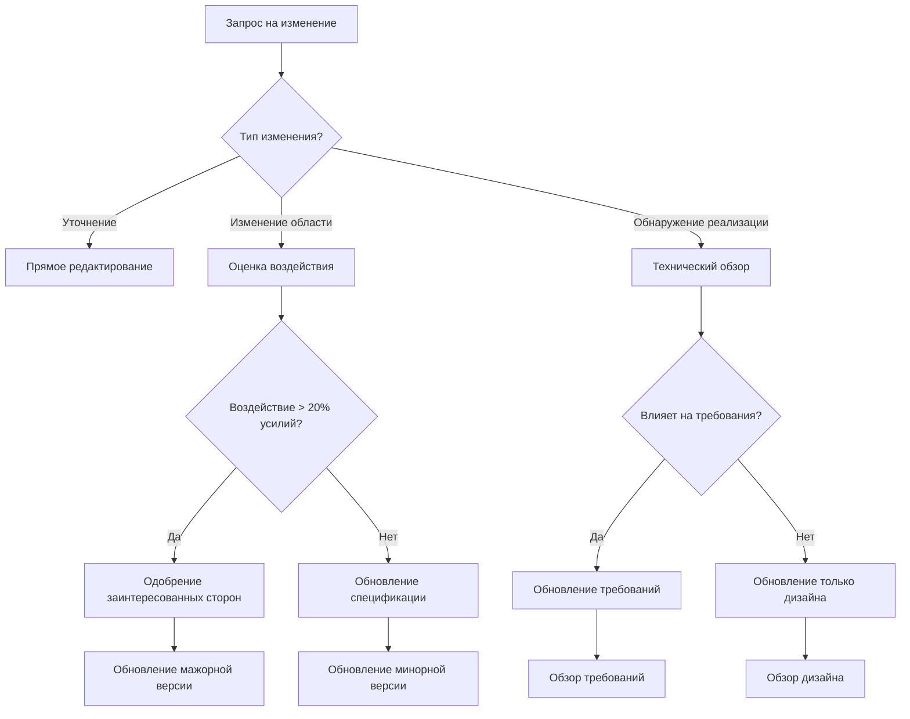

# Управление изменениями

**📍 Вы здесь:** [Главное руководство](../../README.md) → [Руководство по процессу](README.md) → **Управление изменениями**

## Быстрая навигация

- **Предварительные условия:** [Фаза требований](requirements-phase.md), [Фаза дизайна](design-phase.md)
- **Шаблоны:** [Шаблон запроса на изменение](../templates/change-request-template.md)
- **Примеры:** [Примеры управления изменениями](../examples/change-management-examples.md)

---

Управление эволюцией спецификаций и обработка обнаруженных требований во время реализации.

## Обзор

Спецификации - это живые документы, которые эволюционируют по мере углубления понимания. Это руководство покрывает стратегии управления изменениями при поддержании прослеживаемости и качества.

## Типы изменений

### 1. Изменения уточнений

- **Что:** Незначительные уточнения, которые не влияют на область
- **Примеры:** Исправления опечаток, улучшения форматирования, более четкая формулировка
- **Процесс:** Прямое редактирование с сообщением коммита, отмечающим уточнение

### 2. Изменения области

- **Что:** Новые требования или модифицированные существующие
- **Примеры:** Дополнительные пользовательские истории, измененные бизнес-правила
- **Процесс:** Требуется полная оценка воздействия изменений

### 3. Обнаружения реализации

- **Что:** Технические ограничения, обнаруженные во время кодирования
- **Примеры:** Ограничения API, узкие места производительности, требования безопасности
- **Процесс:** Обновление фазы дизайна, возможно требований

## Фреймворк принятия решений об изменениях



## Стратегия контроля версий

### Семантическое версионирование для спецификаций

- **Мажорная (1.0.0 → 2.0.0):** Критические изменения требований или основного дизайна
- **Минорная (1.0.0 → 1.1.0):** Новые требования или значительные изменения дизайна
- **Патч (1.0.0 → 1.0.1):** Уточнения, исправления ошибок, незначительные обновления

### Стратегия ветвления

```
main/
├── spec-v1.0/          # Стабильные версии спецификаций
├── feature/new-req     # Ветки новых требований
└── fix/clarification   # Ветки незначительных исправлений
```

## Оценка воздействия изменений

### Вопросы для рассмотрения

1. **Воздействие на требования**
   - Изменяет ли это существующие пользовательские истории?
   - Нужны ли новые критерии приемки?
   - Становятся ли какие-либо требования устаревшими?

2. **Воздействие на дизайн**
   - Какие компоненты затронуты?
   - Вводятся ли новые зависимости?
   - Нуждается ли архитектура в пересмотре?

3. **Воздействие на реализацию**
   - Сколько задач нужно обновить?
   - Каково предполагаемое изменение усилий?
   - Есть ли новые риски или блокеры?

### Оценка воздействия

- **Низкое (1-2 балла):** Уточнения, незначительные дополнения
- **Среднее (3-5 баллов):** Новые функции, умеренные изменения дизайна
- **Высокое (6-8 баллов):** Крупные изменения области, пересмотры архитектуры
- **Критическое (9-10 баллов):** Фундаментальные изменения требований

## Рабочий процесс изменений

### 1. Создание запроса на изменение

```markdown
## Запрос на изменение: [Краткое описание]

**Тип:** [Уточнение/Область/Обнаружение реализации]
**Заявитель:** [Имя/Роль]
**Дата:** [ГГГГ-ММ-ДД]

### Текущее состояние
[Что существует сейчас]

### Предлагаемое изменение
[Что должно измениться]

### Обоснование
[Почему это изменение необходимо]

### Оценка воздействия
- Требования: [Нет/Незначительное/Крупное]
- Дизайн: [Нет/Незначительное/Крупное]
- Реализация: [Нет/Незначительное/Крупное]
- Изменение усилий: [+/- X часов/дней]

### Требуется одобрение
- [ ] Владелец продукта (для изменений области)
- [ ] Технический лидер (для изменений дизайна)
- [ ] Заинтересованные стороны (для крупных изменений)
```

### 2. Процесс обзора

1. **Технический обзор:** Оценить осуществимость реализации
2. **Бизнес-обзор:** Валидировать бизнес-ценность и приоритет
3. **Анализ воздействия:** Рассчитать изменения усилий и временных рамок
4. **Решение об одобрении:** Идти/Не идти на основе воздействия и ценности

### 3. Реализация

1. **Обновление спецификации:** Модифицировать затронутые разделы
2. **Обновление версии:** Обновить версию согласно типу изменения
3. **Прослеживаемость:** Связать изменения с исходными требованиями
4. **Коммуникация:** Уведомить заинтересованные стороны об изменениях

## Обработка обнаружений реализации

### Распространенные типы обнаружений

1. **Технические ограничения**
   - Ограничения API третьих сторон
   - Требования производительности
   - Соображения безопасности

2. **Проблемы интеграции**
   - Несоответствия форматов данных
   - Сложности аутентификации
   - Зависимости по времени

3. **Проблемы пользовательского опыта**
   - Требования доступности
   - Мобильная отзывчивость
   - Совместимость браузеров

### Процесс ответа на обнаружения

1. **Документирование обнаружения:** Записать, что было найдено и почему это важно
2. **Оценка вариантов:** Перечислить возможные решения и компромиссы
3. **Обновление спецификации:** Модифицировать дизайн или требования по необходимости
4. **Валидация изменений:** Убедиться, что изменения соответствуют исходным целям

## Практики живых спецификаций

### Регулярные циклы обзора

- **Еженедельно:** Проверять обнаружения реализации
- **Конец спринта:** Обозревать завершенные задачи против спецификации
- **Ежемесячно:** Оценивать общее здоровье и точность спецификации

### Метрики здоровья спецификации

- **Точность:** % требований, которые соответствуют реализации
- **Полнота:** % реализации, покрытой спецификацией
- **Актуальность:** Дни с последнего значимого обновления
- **Прослеживаемость:** % изменений кода, связанных с элементами спецификации

### Руководящие принципы обслуживания

1. **Держите актуальным:** Обновляйте спецификации по мере прогресса реализации
2. **Поддерживайте прослеживаемость:** Связывайте все изменения обратно с требованиями
3. **Документируйте решения:** Записывайте, почему были сделаны изменения
4. **Коммуницируйте изменения:** Держите заинтересованные стороны в курсе

## Коммуникация изменений

### Уведомление заинтересованных сторон

```markdown
## Уведомление об изменении спецификации

**Спецификация:** [Название спецификации v1.2.0]
**Тип изменения:** [Незначительное/Крупное]
**Дата:** [ГГГГ-ММ-ДД]

### Резюме
[Краткое описание изменений]

### Воздействие
- Временные рамки: [Без изменений/+X дней]
- Область: [Без изменений/Добавлены/Удалены функции]
- Ресурсы: [Без изменений/+X часов]

### Требуемые действия
- [ ] Обозреть обновленные требования
- [ ] Одобрить изменения дизайна
- [ ] Обновить временные рамки проекта

### Вопросы/Обеспокоенности
Контакт: [Имя] по [email]
```

## Инструменты и интеграция

### Интеграция контроля версий

- Используйте Git теги для версий спецификаций
- Связывайте коммиты с запросами на изменение
- Поддерживайте changelog в репозитории спецификаций

### Интеграция управления проектами

- Обновляйте оценки задач на основе изменений
- Создавайте новые тикеты для работы, вызванной изменениями
- Связывайте изменения с исходными пользовательскими историями

### Интеграция документации

- Автоматически генерируйте журналы изменений
- Обновляйте документацию API
- Синхронизируйте с вики проекта

---

## 🔗 Связанный контент

### Предварительные условия

- [Фаза требований](requirements-phase.md) - Основа для управления изменениями
- [Фаза дизайна](design-phase.md) - Понимание эволюции дизайна

### Шаблоны

- [Шаблон запроса на изменение](../templates/change-request-template.md)
- [Чек-лист оценки воздействия](../templates/checklists.md#change-impact)

### Примеры

- [Кейсы управления изменениями](../examples/change-management-examples.md)

[← Назад к руководству по процессу](README.md) | [Руководство по реализации →](../execution/implementation-guide.md)
