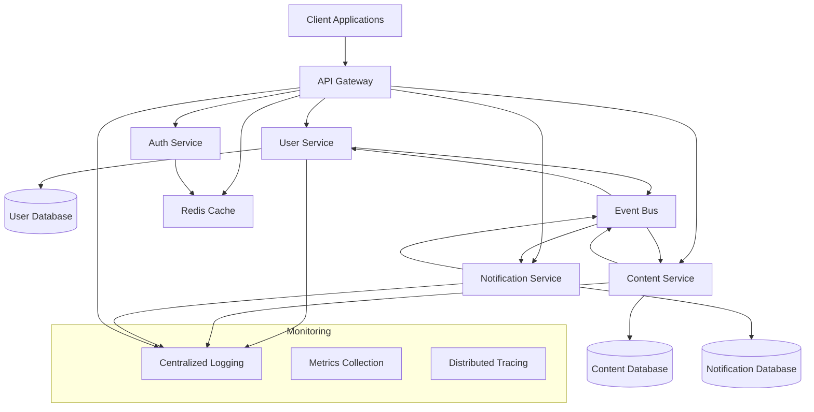
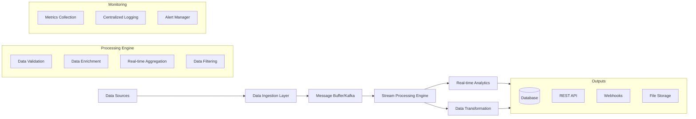

# Complex System Spec Examples

<!-- Navigation Metadata -->
<!-- Example: Complex Systems | Level: Advanced Examples | Prerequisites: simple-feature-spec.md -->
<!-- Related: ai-reasoning/decision-frameworks.md, process/design-phase.md, templates/design-template.md -->

**📍 You are here:** [Main Guide](../../README.md) → [Examples](README.md) → **Complex System Specs**

## Quick Navigation
- **🎯 Start Simple:** [Simple Feature Specs](simple-feature-spec.md) - Learn with basic examples first
- **🧠 Decision Help:** [AI Decision Frameworks](../ai-reasoning/decision-frameworks.md) - Handle complex choices
- **📋 Design Process:** [Design Phase Guide](../process/design-phase.md) - Systematic approach to complexity
- **📝 Design Template:** [Design Template](../templates/design-template.md) - Structure for complex designs

---

This section demonstrates how to apply the spec-driven methodology to larger, more complex systems. These examples show how to handle complexity, break down large features into manageable components, and coordinate multiple interconnected parts.

## Example 1: Multi-Service API Architecture

### Overview
A comprehensive API system that handles user management, content delivery, and real-time notifications across multiple microservices. This example demonstrates how to spec a distributed system with multiple components and complex interactions.

### Complete Spec Documents

#### Requirements Document

```markdown
# Multi-Service API Architecture - Requirements

## Introduction
This feature implements a scalable API architecture consisting of multiple microservices that handle user management, content operations, and real-time notifications. The system must support high availability, horizontal scaling, and consistent data management across services.

## Requirements

### Requirement 1
**User Story:** As a system architect, I want a distributed API architecture, so that the system can scale independently and maintain high availability.

#### Acceptance Criteria
1. WHEN the system receives requests THEN it SHALL route them to appropriate microservices
2. WHEN a service fails THEN the system SHALL continue operating with degraded functionality
3. WHEN load increases THEN individual services SHALL scale independently
4. IF services need to communicate THEN they SHALL use well-defined APIs and messaging

### Requirement 2
**User Story:** As a developer, I want consistent data management across services, so that data integrity is maintained in the distributed system.

#### Acceptance Criteria
1. WHEN data is modified in one service THEN related services SHALL be notified of changes
2. WHEN transactions span multiple services THEN the system SHALL ensure data consistency
3. WHEN services are temporarily unavailable THEN data operations SHALL be queued and retried
4. IF data conflicts occur THEN the system SHALL have resolution strategies

### Requirement 3
**User Story:** As an API consumer, I want unified access to all services, so that I can interact with the system through a single interface.

#### Acceptance Criteria
1. WHEN making API requests THEN clients SHALL use a single entry point
2. WHEN services change internally THEN the external API SHALL remain stable
3. WHEN authentication is required THEN it SHALL work consistently across all services
4. IF rate limiting is needed THEN it SHALL be applied uniformly across the API

### Requirement 4
**User Story:** As a system administrator, I want comprehensive monitoring and observability, so that I can maintain system health and performance.

#### Acceptance Criteria
1. WHEN services are running THEN the system SHALL provide health checks and metrics
2. WHEN errors occur THEN they SHALL be logged and traced across service boundaries
3. WHEN performance degrades THEN alerts SHALL be triggered with actionable information
4. IF debugging is needed THEN distributed traces SHALL be available for request flows
```

#### Design Document

```markdown
# Multi-Service API Architecture - Design

## Overview
The system will be implemented using a microservices architecture with an API Gateway for unified access, event-driven communication between services, and shared infrastructure for cross-cutting concerns like authentication, logging, and monitoring.

## Architecture

### High-Level Architecture


## Components and Interfaces

### API Gateway
- **Purpose**: Single entry point, routing, authentication, rate limiting
- **Technology**: Kong/Nginx with custom plugins
- **Responsibilities**: Request routing, SSL termination, CORS, rate limiting

### Core Services

#### User Service
```typescript
interface UserService {
  // User management
  createUser(userData: CreateUserRequest): Promise<User>;
  getUserById(id: string): Promise<User>;
  updateUser(id: string, updates: UpdateUserRequest): Promise<User>;
  deleteUser(id: string): Promise<void>;
  
  // Authentication integration
  validateUserCredentials(email: string, password: string): Promise<AuthResult>;
  updateUserProfile(id: string, profile: ProfileData): Promise<User>;
}
```

#### Content Service
```typescript
interface ContentService {
  // Content operations
  createContent(authorId: string, content: CreateContentRequest): Promise<Content>;
  getContent(id: string): Promise<Content>;
  updateContent(id: string, updates: UpdateContentRequest): Promise<Content>;
  deleteContent(id: string): Promise<void>;
  
  // Content discovery
  searchContent(query: SearchQuery): Promise<ContentSearchResult>;
  getContentByAuthor(authorId: string): Promise<Content[]>;
  getFeedForUser(userId: string): Promise<Content[]>;
}
```

#### Notification Service
```typescript
interface NotificationService {
  // Notification management
  createNotification(notification: CreateNotificationRequest): Promise<Notification>;
  getNotificationsForUser(userId: string): Promise<Notification[]>;
  markNotificationAsRead(id: string): Promise<void>;
  
  // Real-time delivery
  subscribeToNotifications(userId: string): Promise<WebSocketConnection>;
  sendRealTimeNotification(userId: string, notification: Notification): Promise<void>;
}
```

### Event-Driven Communication
```typescript
interface EventBus {
  publish(event: DomainEvent): Promise<void>;
  subscribe(eventType: string, handler: EventHandler): Promise<void>;
  unsubscribe(eventType: string, handler: EventHandler): Promise<void>;
}

interface DomainEvent {
  id: string;
  type: string;
  aggregateId: string;
  payload: any;
  timestamp: Date;
  version: number;
}
```

## Data Models

### Service Data Isolation
- Each service owns its data and database
- No direct database access between services
- Data synchronization through events
- Eventual consistency model

### Shared Data Patterns
- **User Identity**: Shared user ID across services
- **Content References**: Content IDs used in notifications
- **Event Sourcing**: Domain events for audit and replay

## Error Handling

### Circuit Breaker Pattern
- Prevent cascade failures between services
- Automatic recovery and health checking
- Configurable failure thresholds

### Retry and Timeout Strategies
- Exponential backoff for transient failures
- Service-specific timeout configurations
- Dead letter queues for failed events

### Graceful Degradation
- Core functionality continues when non-critical services fail
- Cached responses when services are unavailable
- User-friendly error messages for service outages

## Testing Strategy

### Service-Level Testing
- Unit tests for business logic within each service
- Integration tests for database and external dependencies
- Contract testing between services

### System-Level Testing
- End-to-end tests for complete user workflows
- Load testing for scalability validation
- Chaos engineering for resilience testing

### Monitoring and Observability
- Health checks for each service endpoint
- Distributed tracing for request flows
- Business metrics and alerting
```

#### Tasks Document

```markdown
# Multi-Service API Architecture - Implementation Plan

- [ ] 1. Set up development infrastructure and tooling
  - Create Docker Compose setup for local development
  - Set up CI/CD pipeline with service-specific builds
  - Configure shared development tools (linting, testing, documentation)
  - Create infrastructure-as-code templates for deployment
  - _Requirements: 1.1, 4.1_

- [ ] 2. Implement shared libraries and utilities
- [ ] 2.1 Create common data models and interfaces
  - Define shared TypeScript interfaces for cross-service communication
  - Implement common error types and response formats
  - Create validation schemas for API contracts
  - Write unit tests for shared utilities
  - _Requirements: 2.1, 3.2_

- [ ] 2.2 Build event bus infrastructure
  - Implement event publishing and subscription interfaces
  - Create event serialization and deserialization utilities
  - Add event versioning and backward compatibility support
  - Write integration tests for event bus functionality
  - _Requirements: 2.1, 2.2_

- [ ] 2.3 Create authentication and authorization library
  - Implement JWT token validation middleware
  - Create role-based access control utilities
  - Add service-to-service authentication mechanisms
  - Write security tests for authentication flows
  - _Requirements: 3.3_

- [ ] 3. Build User Service
- [ ] 3.1 Implement user data model and repository
  - Create User entity with validation and business rules
  - Implement database schema and migrations
  - Build repository pattern for user data access
  - Write unit tests for user model and repository
  - _Requirements: 1.1, 2.1_

- [ ] 3.2 Create user management API endpoints
  - Implement CRUD operations for user management
  - Add user profile management functionality
  - Create user search and filtering capabilities
  - Write integration tests for user API endpoints
  - _Requirements: 1.1, 3.1_

- [ ] 3.3 Add user event publishing
  - Implement user lifecycle events (created, updated, deleted)
  - Add event publishing for profile changes
  - Create event handlers for user-related notifications
  - Write tests for event publishing and handling
  - _Requirements: 2.1, 2.2_

- [ ] 4. Build Content Service
- [ ] 4.1 Implement content data model and storage
  - Create Content entity with metadata and relationships
  - Design database schema for content storage and indexing
  - Implement content repository with search capabilities
  - Write unit tests for content model and repository
  - _Requirements: 1.1, 2.1_

- [ ] 4.2 Create content management API
  - Implement content CRUD operations with authorization
  - Add content search and filtering functionality
  - Create content feed generation for users
  - Write integration tests for content API endpoints
  - _Requirements: 1.1, 3.1_

- [ ] 4.3 Add content event handling
  - Implement content lifecycle events
  - Add event handlers for user changes affecting content
  - Create content recommendation event processing
  - Write tests for content event flows
  - _Requirements: 2.1, 2.2_

- [ ] 5. Build Notification Service
- [ ] 5.1 Implement notification data model and delivery
  - Create Notification entity with delivery status tracking
  - Design database schema for notification storage
  - Implement notification repository with user filtering
  - Write unit tests for notification model and repository
  - _Requirements: 1.1, 2.1_

- [ ] 5.2 Create real-time notification system
  - Implement WebSocket server for real-time delivery
  - Add notification subscription and unsubscription logic
  - Create notification formatting and templating system
  - Write integration tests for real-time notification delivery
  - _Requirements: 1.1, 3.1_

- [ ] 5.3 Add notification event processing
  - Implement event handlers for user and content changes
  - Add notification generation rules and business logic
  - Create notification delivery retry mechanisms
  - Write tests for notification event processing
  - _Requirements: 2.1, 2.2_

- [ ] 6. Implement API Gateway
- [ ] 6.1 Set up gateway routing and middleware
  - Configure API Gateway with service routing rules
  - Implement authentication middleware for all routes
  - Add rate limiting and request validation middleware
  - Write integration tests for gateway functionality
  - _Requirements: 3.1, 3.2, 3.3_

- [ ] 6.2 Add gateway monitoring and logging
  - Implement request/response logging with correlation IDs
  - Add performance metrics collection for all routes
  - Create health check endpoints for service monitoring
  - Write tests for monitoring and logging functionality
  - _Requirements: 4.1, 4.2_

- [ ] 7. Implement cross-cutting concerns
- [ ] 7.1 Add distributed tracing
  - Implement tracing middleware for all services
  - Add trace correlation across service boundaries
  - Create trace visualization and analysis tools
  - Write tests for tracing functionality
  - _Requirements: 4.2, 4.4_

- [ ] 7.2 Create centralized logging system
  - Implement structured logging across all services
  - Add log aggregation and centralized storage
  - Create log analysis and alerting rules
  - Write tests for logging system functionality
  - _Requirements: 4.2, 4.3_

- [ ] 8. Add resilience and error handling
- [ ] 8.1 Implement circuit breaker pattern
  - Add circuit breaker middleware for service-to-service calls
  - Create configurable failure thresholds and recovery logic
  - Implement fallback mechanisms for service failures
  - Write tests for circuit breaker functionality
  - _Requirements: 1.2, 2.3_

- [ ] 8.2 Create retry and timeout mechanisms
  - Implement exponential backoff for transient failures
  - Add configurable timeout settings for all service calls
  - Create dead letter queues for failed event processing
  - Write tests for retry and timeout behavior
  - _Requirements: 1.2, 2.3_

- [ ] 9. Build monitoring and alerting system
- [ ] 9.1 Implement health checks and metrics
  - Create comprehensive health check endpoints for all services
  - Add business and technical metrics collection
  - Implement service dependency health monitoring
  - Write tests for health check and metrics functionality
  - _Requirements: 4.1, 4.3_

- [ ] 9.2 Create alerting and notification system
  - Implement alerting rules for critical system events
  - Add escalation policies for different types of alerts
  - Create dashboard for system monitoring and visualization
  - Write tests for alerting system functionality
  - _Requirements: 4.3, 4.4_

- [ ] 10. Integration testing and deployment
- [ ] 10.1 Create end-to-end test suite
  - Implement complete user workflow tests across all services
  - Add load testing for system scalability validation
  - Create chaos engineering tests for resilience validation
  - Write performance benchmarks for system optimization
  - _Requirements: 1.1, 1.2, 1.3_

- [ ] 10.2 Set up production deployment pipeline
  - Create deployment scripts and infrastructure automation
  - Implement blue-green deployment strategy for zero-downtime updates
  - Add database migration and rollback procedures
  - Write deployment validation and rollback tests
  - _Requirements: 1.1, 1.3_
```

### Key Decision Commentary

#### Why Microservices Architecture?
- **Scalability**: Each service can scale independently based on demand
- **Technology Diversity**: Different services can use optimal technologies
- **Team Autonomy**: Teams can develop and deploy services independently
- **Fault Isolation**: Failures in one service don't bring down the entire system

#### Event-Driven Communication Strategy
- **Loose Coupling**: Services don't need direct knowledge of each other
- **Scalability**: Asynchronous processing handles high loads better
- **Resilience**: Events can be queued and retried if services are unavailable
- **Auditability**: Event log provides complete system activity history

#### API Gateway Benefits
- **Single Entry Point**: Simplifies client integration and security
- **Cross-Cutting Concerns**: Centralized authentication, rate limiting, logging
- **Service Evolution**: Internal service changes don't affect external API
- **Monitoring**: Centralized point for API metrics and observability

### Implementation Notes

This complex system results in multiple service repositories:
- `api-gateway/` - Gateway configuration and custom middleware
- `user-service/` - User management microservice
- `content-service/` - Content management microservice  
- `notification-service/` - Real-time notification microservice
- `shared-libs/` - Common utilities and interfaces
- `infrastructure/` - Docker, Kubernetes, and deployment configurations
- `monitoring/` - Logging, metrics, and alerting configurations

### Lessons Learned

**What Worked Well:**
- Starting with shared interfaces prevented integration issues later
- Event-driven architecture provided excellent decoupling
- Comprehensive monitoring was essential for debugging distributed issues
- Infrastructure-as-code made deployment and scaling much easier

**What Could Be Improved:**
- Data consistency requirements could have been more specific
- Service discovery and configuration management needed more attention
- Security requirements for service-to-service communication were underspecified
- Performance requirements should have included specific latency targets

---

## Example 2: Real-Time Data Processing Pipeline

### Overview
A high-throughput data processing system that ingests streaming data, processes it through multiple stages, and outputs results to various destinations. This example demonstrates how to spec a system with complex data flows and real-time processing requirements.

### Complete Spec Documents

#### Requirements Document

```markdown
# Real-Time Data Processing Pipeline - Requirements

## Introduction
This feature implements a scalable real-time data processing pipeline that can ingest high-volume streaming data, apply transformations and analytics, and deliver processed results to multiple output destinations with low latency and high reliability.

## Requirements

### Requirement 1
**User Story:** As a data engineer, I want a high-throughput data ingestion system, so that I can process large volumes of streaming data in real-time.

#### Acceptance Criteria
1. WHEN data streams arrive THEN the system SHALL ingest at least 100,000 events per second
2. WHEN ingestion load varies THEN the system SHALL auto-scale to handle traffic spikes
3. WHEN data sources are temporarily unavailable THEN the system SHALL buffer and retry ingestion
4. IF data format is invalid THEN the system SHALL log errors and continue processing valid data

### Requirement 2
**User Story:** As a data analyst, I want configurable data transformations, so that I can process raw data into meaningful insights.

#### Acceptance Criteria
1. WHEN processing data THEN the system SHALL apply configurable transformation rules
2. WHEN transformations fail THEN the system SHALL handle errors gracefully and continue processing
3. WHEN new transformation logic is needed THEN it SHALL be deployable without system downtime
4. IF data quality issues are detected THEN the system SHALL flag and quarantine problematic data

### Requirement 3
**User Story:** As a business user, I want real-time analytics and aggregations, so that I can make timely decisions based on current data.

#### Acceptance Criteria
1. WHEN data is processed THEN the system SHALL compute real-time aggregations within 5 seconds
2. WHEN analytics results are ready THEN they SHALL be available through multiple output channels
3. WHEN historical data is needed THEN the system SHALL maintain configurable retention periods
4. IF analytics computations fail THEN the system SHALL retry and alert on persistent failures

### Requirement 4
**User Story:** As a system administrator, I want comprehensive monitoring and alerting, so that I can ensure pipeline reliability and performance.

#### Acceptance Criteria
1. WHEN the pipeline is running THEN the system SHALL provide real-time metrics on throughput and latency
2. WHEN errors occur THEN they SHALL be logged with sufficient context for debugging
3. WHEN performance degrades THEN alerts SHALL be triggered with actionable information
4. IF data loss occurs THEN the system SHALL detect and report the issue immediately
```

#### Design Document

```markdown
# Real-Time Data Processing Pipeline - Design

## Overview
The pipeline will be implemented using a stream processing architecture with Apache Kafka for data ingestion, Apache Flink for real-time processing, and multiple output connectors for data delivery. The system will support horizontal scaling and fault tolerance.

## Architecture

### Data Flow Architecture


## Components and Interfaces

### Data Ingestion Layer
```typescript
interface DataIngestionService {
  // Data ingestion
  ingestData(source: DataSource, data: RawDataEvent[]): Promise<IngestionResult>;
  registerDataSource(source: DataSourceConfig): Promise<void>;
  
  // Health and monitoring
  getIngestionMetrics(): Promise<IngestionMetrics>;
  getSourceStatus(sourceId: string): Promise<SourceStatus>;
}

interface RawDataEvent {
  id: string;
  source: string;
  timestamp: Date;
  payload: any;
  metadata?: Record<string, any>;
}
```

### Stream Processing Engine
```typescript
interface StreamProcessor {
  // Processing pipeline
  processStream(inputStream: DataStream): DataStream;
  addTransformation(transformation: TransformationFunction): void;
  addAggregation(aggregation: AggregationFunction): void;
  
  // Pipeline management
  startProcessing(): Promise<void>;
  stopProcessing(): Promise<void>;
  getProcessingMetrics(): Promise<ProcessingMetrics>;
}

interface TransformationFunction {
  name: string;
  transform(event: ProcessedDataEvent): ProcessedDataEvent | null;
  validate(event: ProcessedDataEvent): ValidationResult;
}
```

### Output Management
```typescript
interface OutputManager {
  // Output destinations
  registerOutput(output: OutputDestination): Promise<void>;
  sendToOutput(destination: string, data: ProcessedDataEvent[]): Promise<void>;
  
  // Delivery management
  retryFailedDeliveries(): Promise<void>;
  getDeliveryMetrics(): Promise<DeliveryMetrics>;
}

interface OutputDestination {
  id: string;
  type: 'database' | 'api' | 'webhook' | 'file';
  config: OutputConfig;
  retryPolicy: RetryPolicy;
}
```

## Data Models

### Event Data Model
```typescript
interface ProcessedDataEvent {
  id: string;
  originalId: string;
  source: string;
  eventType: string;
  timestamp: Date;
  processedAt: Date;
  data: Record<string, any>;
  metadata: EventMetadata;
  quality: DataQualityScore;
}

interface EventMetadata {
  processingStage: string;
  transformationsApplied: string[];
  validationResults: ValidationResult[];
  enrichmentData?: Record<string, any>;
}
```

### Configuration Models
```typescript
interface PipelineConfig {
  ingestion: IngestionConfig;
  processing: ProcessingConfig;
  outputs: OutputConfig[];
  monitoring: MonitoringConfig;
}

interface ProcessingConfig {
  transformations: TransformationConfig[];
  aggregations: AggregationConfig[];
  errorHandling: ErrorHandlingConfig;
  scalingPolicy: ScalingPolicy;
}
```

## Error Handling

### Fault Tolerance Strategies
- **At-least-once Processing**: Ensure no data loss during processing
- **Checkpointing**: Regular state snapshots for recovery
- **Dead Letter Queues**: Isolate problematic events for manual review
- **Circuit Breakers**: Prevent cascade failures in output destinations

### Data Quality Management
- **Schema Validation**: Ensure data conforms to expected structure
- **Data Profiling**: Monitor data quality metrics over time
- **Anomaly Detection**: Identify unusual patterns in data streams
- **Quarantine System**: Isolate low-quality data for investigation

## Testing Strategy

### Stream Processing Testing
- Unit tests for individual transformation functions
- Integration tests for complete processing pipelines
- Load testing for throughput and latency requirements
- Chaos testing for fault tolerance validation

### Data Quality Testing
- Schema validation testing with various data formats
- Data lineage testing to ensure traceability
- Performance testing under various load conditions
- Recovery testing for system failures
```

#### Tasks Document

```markdown
# Real-Time Data Processing Pipeline - Implementation Plan

- [ ] 1. Set up streaming infrastructure foundation
  - Set up Apache Kafka cluster for message buffering
  - Configure Apache Flink cluster for stream processing
  - Create Docker Compose setup for local development
  - Set up monitoring infrastructure (Prometheus, Grafana)
  - _Requirements: 1.1, 4.1_

- [ ] 2. Implement data ingestion layer
- [ ] 2.1 Create data source connectors
  - Implement HTTP/REST API ingestion endpoint
  - Create file-based data source connector (CSV, JSON)
  - Add database change data capture (CDC) connector
  - Write unit tests for all connector implementations
  - _Requirements: 1.1, 1.4_

- [ ] 2.2 Build ingestion service with buffering
  - Implement Kafka producer for data buffering
  - Add data source registration and management
  - Create ingestion rate limiting and backpressure handling
  - Write integration tests for ingestion service
  - _Requirements: 1.1, 1.2, 1.3_

- [ ] 2.3 Add ingestion monitoring and metrics
  - Implement throughput and latency metrics collection
  - Add data source health monitoring
  - Create alerting for ingestion failures and bottlenecks
  - Write tests for monitoring functionality
  - _Requirements: 4.1, 4.2_

- [ ] 3. Build stream processing engine
- [ ] 3.1 Implement core processing framework
  - Create Flink job framework for stream processing
  - Implement event deserialization and schema validation
  - Add processing pipeline orchestration
  - Write unit tests for processing framework
  - _Requirements: 2.1, 2.4_

- [ ] 3.2 Create data transformation system
  - Implement configurable transformation functions
  - Add data enrichment capabilities with external lookups
  - Create data filtering and routing logic
  - Write unit tests for transformation functions
  - _Requirements: 2.1, 2.2, 2.3_

- [ ] 3.3 Build real-time aggregation engine
  - Implement windowed aggregations (tumbling, sliding, session)
  - Add stateful processing for complex event patterns
  - Create aggregation result publishing to output topics
  - Write integration tests for aggregation functionality
  - _Requirements: 3.1, 3.2_

- [ ] 4. Implement data quality and validation
- [ ] 4.1 Create data validation framework
  - Implement schema validation for incoming events
  - Add data quality scoring and profiling
  - Create anomaly detection for unusual data patterns
  - Write unit tests for validation logic
  - _Requirements: 2.4, 4.4_

- [ ] 4.2 Build error handling and recovery
  - Implement dead letter queue for invalid data
  - Add automatic retry mechanisms for transient failures
  - Create data quarantine system for quality issues
  - Write tests for error handling scenarios
  - _Requirements: 1.4, 2.2, 4.4_

- [ ] 5. Create output management system
- [ ] 5.1 Implement output destination connectors
  - Create database output connector with batch writing
  - Implement REST API output connector with retry logic
  - Add webhook output connector for real-time notifications
  - Write integration tests for all output connectors
  - _Requirements: 3.2, 3.3_

- [ ] 5.2 Build delivery management and reliability
  - Implement delivery confirmation and retry policies
  - Add output destination health monitoring
  - Create delivery metrics and success rate tracking
  - Write tests for delivery reliability features
  - _Requirements: 3.2, 4.4_

- [ ] 6. Add real-time analytics capabilities
- [ ] 6.1 Implement analytics computation engine
  - Create real-time dashboard data computation
  - Add trend analysis and pattern detection
  - Implement alerting based on analytics results
  - Write unit tests for analytics computations
  - _Requirements: 3.1, 3.4_

- [ ] 6.2 Build analytics data storage and retrieval
  - Implement time-series database integration
  - Add analytics query API for dashboard consumption
  - Create data retention and archival policies
  - Write integration tests for analytics storage
  - _Requirements: 3.2, 3.3_

- [ ] 7. Implement comprehensive monitoring
- [ ] 7.1 Create pipeline metrics and observability
  - Implement end-to-end latency tracking
  - Add throughput metrics for each pipeline stage
  - Create data lineage tracking and visualization
  - Write tests for metrics collection accuracy
  - _Requirements: 4.1, 4.2_

- [ ] 7.2 Build alerting and notification system
  - Implement threshold-based alerting for key metrics
  - Add anomaly detection alerts for unusual patterns
  - Create escalation policies for critical issues
  - Write tests for alerting system functionality
  - _Requirements: 4.3, 4.4_

- [ ] 8. Add scalability and performance optimization
- [ ] 8.1 Implement auto-scaling mechanisms
  - Create horizontal scaling policies for Flink jobs
  - Add Kafka partition scaling based on throughput
  - Implement resource utilization monitoring
  - Write load tests to validate scaling behavior
  - _Requirements: 1.2, 1.1_

- [ ] 8.2 Optimize processing performance
  - Implement processing parallelization strategies
  - Add memory and CPU optimization for transformations
  - Create performance benchmarking and profiling tools
  - Write performance tests for optimization validation
  - _Requirements: 1.1, 3.1_

- [ ] 9. Build configuration and deployment system
- [ ] 9.1 Create pipeline configuration management
  - Implement dynamic configuration updates without downtime
  - Add configuration validation and testing framework
  - Create configuration versioning and rollback capabilities
  - Write tests for configuration management functionality
  - _Requirements: 2.3, 2.1_

- [ ] 9.2 Set up deployment and operations
  - Create Kubernetes deployment manifests for all components
  - Implement blue-green deployment for zero-downtime updates
  - Add backup and disaster recovery procedures
  - Write deployment validation and rollback tests
  - _Requirements: 1.2, 4.1_

- [ ] 10. Integration testing and validation
- [ ] 10.1 Create end-to-end testing suite
  - Implement complete data flow testing from ingestion to output
  - Add load testing for throughput requirements validation
  - Create chaos engineering tests for fault tolerance
  - Write data quality and accuracy validation tests
  - _Requirements: 1.1, 2.1, 3.1, 4.1_

- [ ] 10.2 Build operational runbooks and documentation
  - Create troubleshooting guides for common issues
  - Add operational procedures for scaling and maintenance
  - Implement system health dashboards and monitoring guides
  - Write comprehensive system documentation and architecture guides
  - _Requirements: 4.2, 4.3_
```

### Key Decision Commentary

#### Why Apache Kafka + Apache Flink?
- **Kafka**: Proven scalability for high-throughput data ingestion and buffering
- **Flink**: Excellent stream processing capabilities with exactly-once semantics
- **Ecosystem**: Rich connector ecosystem for various data sources and sinks
- **Community**: Strong open-source community and enterprise support

#### Stream Processing vs Batch Processing
- **Real-time Requirements**: Business needs require sub-5-second processing latency
- **Continuous Data**: Streaming data sources require continuous processing
- **Resource Efficiency**: Stream processing uses resources more efficiently than frequent batch jobs
- **Scalability**: Stream processing scales better with data volume increases

### Implementation Notes

This complex pipeline results in multiple specialized components:
- `ingestion-service/` - Data ingestion and source management
- `stream-processor/` - Flink jobs and transformation logic
- `output-manager/` - Output destination management and delivery
- `analytics-engine/` - Real-time analytics computation
- `monitoring/` - Comprehensive observability stack
- `infrastructure/` - Kafka, Flink, and Kubernetes configurations
- `config-management/` - Dynamic configuration system

### Lessons Learned

**What Worked Well:**
- Separating ingestion, processing, and output concerns improved maintainability
- Comprehensive monitoring was crucial for debugging distributed processing issues
- Schema validation early in the pipeline prevented downstream problems
- Auto-scaling policies handled traffic spikes effectively

**What Could Be Improved:**
- Data retention requirements needed more specific business input
- Security requirements for data encryption and access control were underspecified
- Cost optimization strategies should have been considered earlier
- Disaster recovery procedures needed more detailed planning

---

## Usage Guidelines

### When to Use Complex System Examples

**Multi-Service API Architecture** is ideal for:
- Learning how to break down large systems into manageable services
- Understanding distributed system challenges and solutions
- Seeing how to coordinate multiple teams and codebases
- Planning systems that need independent scaling and deployment

**Real-Time Data Processing Pipeline** is perfect for:
- Understanding high-throughput system requirements
- Learning about stream processing and real-time analytics
- Seeing how to handle data quality and reliability at scale
- Planning systems with complex data transformation needs

### Adapting Complex Examples

Both examples can be adapted for different scales and requirements:
- **Start Simple**: Begin with fewer services/stages and add complexity gradually
- **Technology Substitution**: Replace specific technologies while keeping architectural patterns
- **Scale Adjustment**: Modify throughput and latency requirements based on actual needs
- **Domain Adaptation**: Apply the same patterns to different business domains

### Key Takeaways for Complex Systems

1. **Break Down Complexity**: Large systems become manageable when broken into well-defined components
2. **Define Clear Interfaces**: Service boundaries and data contracts are crucial for coordination
3. **Plan for Failure**: Complex systems will have failures - design for resilience from the start
4. **Monitor Everything**: Observability is essential for understanding and debugging distributed systems
5. **Iterate and Evolve**: Start with core functionality and add complexity incrementally

---

[← Simple Feature Examples](simple-feature-spec.md) | [Case Studies →](case-studies.md)