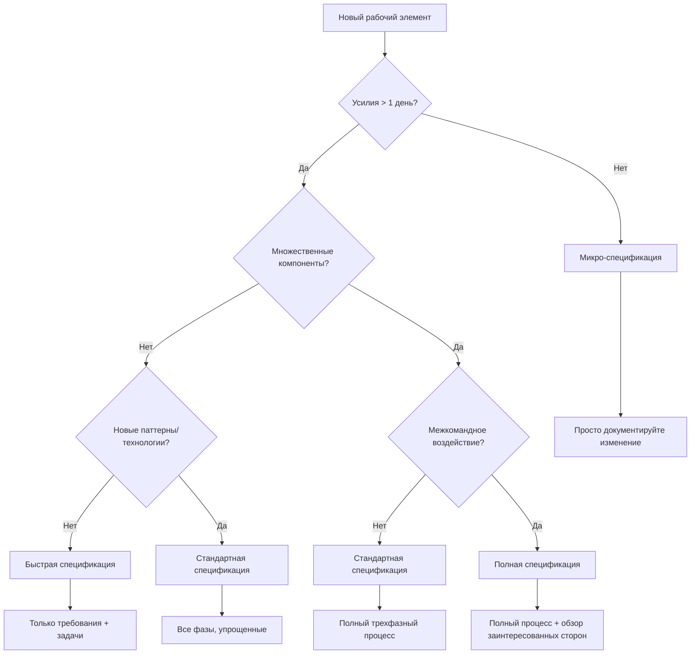

# Облегченные спецификации

**📍 Вы здесь:** [Главное руководство](../../README.md) → [Методология](README.md) → **Облегченные спецификации**

## Быстрая навигация

- **Предварительные условия:** [Когда использовать спецификации](when-to-use.md)
- **Шаблоны:** [Шаблон быстрой спецификации](../templates/quick-spec-template.md)
- **Примеры:** [Примеры облегченных спецификаций](../examples/lightweight-examples.md)

---

Упрощенный процесс спецификаций для небольших функций, исправлений ошибок и быстрых итераций.

## Обзор

Не каждое изменение требует полной трехфазной спецификации. Это руководство поможет вам выбрать правильный уровень спецификации на основе сложности, риска и воздействия.

## Дерево решений сложности спецификации



## Типы спецификаций

### 1. Микро-спецификация (< 1 день усилий)

**Используется для:**

- Исправлений ошибок
- Изменений текста
- Обновлений конфигурации
- Незначительных изменений UI

**Формат:**

```markdown
# [Краткое описание]

**Что:** Одно предложение, описывающее изменение
**Почему:** Краткое обоснование
**Как:** 2-3 пункта шагов реализации
**Приемка:** Простые критерии прошел/не прошел
```

**Пример:**

```markdown
# Исправление цвета кнопки входа

**Что:** Изменить цвет кнопки входа с синего на зеленый в соответствии с руководящими принципами бренда
**Почему:** Требование согласованности бренда от команды дизайна
**Как:** 
- Обновить CSS переменную `--primary-button-color` на `#28a745`
- Проверить, что цвет соответствует требованиям контрастности доступности
**Приемка:** Кнопка входа отображается зеленой и проходит тест контрастности WCAG AA
```

### 2. Быстрая спецификация (1-3 дня усилий)

**Используется для:**

- Небольших функций
- Добавлений API endpoints
- Изменений схемы базы данных
- Модификаций компонентов

**Формат:**

- **Требования:** 2-3 пользовательские истории в упрощенном формате
- **Задачи:** Прямые шаги реализации (пропустить фазу дизайна)
- **Приемка:** Четкие критерии успеха

**Шаблон:**

```markdown
# [Название функции] - Быстрая спецификация

## Требования
**Как** [тип пользователя]
**Я хочу** [возможность]
**Чтобы** [преимущество]

**Критерии приемки:**
- [ ] [Конкретный, тестируемый критерий]
- [ ] [Другой критерий]

## Задачи реализации
1. [Конкретная задача кодирования с оценкой времени]
2. [Другая задача]
3. [Задача тестирования/валидации]

## Определение готовности
- [ ] Код завершен и проверен
- [ ] Тесты проходят
- [ ] Критерии приемки проверены
```

### 3. Стандартная спецификация (3-10 дней усилий)

**Используется для:**

- Средних функций
- Новых интеграций
- Улучшений производительности
- Улучшений безопасности

**Формат:**

- **Требования:** Полный формат EARS, но меньше историй
- **Дизайн:** Упрощенный обзор архитектуры
- **Задачи:** Детальный план реализации

### 4. Полная спецификация (> 10 дней усилий)

**Используется для:**

- Крупных функций
- Перепроектирования систем
- Межкомандных инициатив
- Высокорисковых изменений

**Формат:** Полный трехфазный процесс, как описано в основном руководстве

## Форматы облегченных требований

### Упрощенные пользовательские истории

Вместо полного формата EARS используйте:

```markdown
**История:** Как [пользователь], я хочу [цель], чтобы [преимущество]
**Дано** [контекст]
**Когда** [действие]
**Тогда** [результат]
```

### Сокращения критериев приемки

- **Счастливый путь:** Что должно работать нормально
- **Граничные случаи:** 1-2 наиболее вероятных граничных случая
- **Обработка ошибок:** Как обрабатываются сбои

### Нефункциональные требования

Формат быстрого чек-листа:

- [ ] Производительность: [конкретное требование]
- [ ] Безопасность: [конкретное требование]
- [ ] Доступность: [конкретное требование]
- [ ] Поддержка браузеров: [конкретное требование]

## Быстрые паттерны дизайна

### Изменения компонентов

```markdown
## Обзор дизайна
**Существующее:** [Текущее поведение компонента]
**Изменения:** [Что будет отличаться]
**Зависимости:** [На что это влияет]
**Риски:** [Потенциальные проблемы]
```

### Изменения API

```markdown
## Дизайн API
**Endpoint:** [Метод и путь]
**Вход:** [Формат запроса]
**Выход:** [Формат ответа]
**Ошибки:** [Ответы об ошибках]
```

### Изменения базы данных

```markdown
## Изменения данных
**Таблицы:** [Затронутые таблицы]
**Поля:** [Новые/измененные поля]
**Миграция:** [Как мигрировать существующие данные]
**Откат:** [Как отменить при необходимости]
```

## Сокращения разбиения задач

### Стандартные категории задач

1. **Настройка:** Окружение, зависимости, конфигурация
2. **Основная логика:** Основная работа по реализации
3. **Интеграция:** Подключение к существующим системам
4. **Тестирование:** Модульные тесты, интеграционные тесты
5. **Документация:** Комментарии к коду, обновления README
6. **Развертывание:** Подготовка к выпуску

### Руководящие принципы оценки времени

- **Простой CRUD:** 2-4 часа на endpoint
- **UI компоненты:** 4-8 часов на компонент
- **Интеграция:** 1-2 дня на внешний сервис
- **Тестирование:** 25-50% времени разработки
- **Документация:** 10-20% времени разработки

## Контрольные точки качества для облегченных спецификаций

### Контрольные точки микро-спецификации

- [ ] Изменение четко описано
- [ ] Подход к реализации очевиден
- [ ] Критерии успеха определены

### Контрольные точки быстрой спецификации

- [ ] Пользовательская ценность сформулирована
- [ ] Технический подход обоснован
- [ ] Оценка усилий разумна
- [ ] Зависимости выявлены

### Контрольные точки стандартной спецификации

- [ ] Требования тестируемы
- [ ] Дизайн охватывает все требования
- [ ] Задачи выполнимы и оценены
- [ ] Риски выявлены и смягчены

## Распространенные паттерны облегченных спецификаций

### Паттерн исправления ошибок

```markdown
# Ошибка: [Краткое описание]

**Проблема:** [Что сломано]
**Корневая причина:** [Почему сломано]
**Исправление:** [Как исправить]
**Тест:** [Как проверить исправление]
**Риск:** [Что может пойти не так]
```

### Паттерн переключателя функций

```markdown
# Функция: [Название] (За переключателем)

**Переключатель:** `feature_[name]_enabled`
**По умолчанию:** `false`
**Развертывание:** Постепенное, начиная с внутренних пользователей

**Реализация:**
- [ ] Добавить переключатель функции
- [ ] Реализовать функцию за переключателем
- [ ] Добавить мониторинг/метрики
- [ ] Спланировать стратегию развертывания
```

### Паттерн изменения конфигурации

```markdown
# Конфигурация: [Описание]

**Окружение:** [Какие окружения]
**Значения:** [Что изменяется]
**Воздействие:** [На что это влияет]
**Откат:** [Как отменить]
**Валидация:** [Как проверить, что сработало]
```

## Когда повышать сложность спецификации

### Красные флаги для микро-спецификаций

- Реализация занимает больше времени, чем ожидалось
- Необходимы изменения в нескольких файлах
- Другие разработчики задают уточняющие вопросы
- Тестирование выявляет граничные случаи, которые не были учтены

### Красные флаги для быстрых спецификаций

- Во время реализации возникают вопросы дизайна
- Обнаруживаются зависимости от других команд
- Становятся очевидными последствия для производительности
- Требуется обзор безопасности

### Процесс повышения

1. **Приостановить реализацию:** Остановить кодирование при увеличении сложности
2. **Оценить пробел:** Какая дополнительная спецификация нужна?
3. **Повысить спецификацию:** Добавить недостающие требования, дизайн или задачи
4. **Получить одобрение:** Просмотреть обновленную спецификацию с заинтересованными сторонами
5. **Возобновить реализацию:** Продолжить с лучшей спецификацией

## Инструменты и шаблоны

### Цифровые шаблоны

- **Микро-спецификация:** Одна секция markdown
- **Быстрая спецификация:** Шаблон GitHub issue
- **Стандартная спецификация:** Упрощенный трехфазный шаблон

### Точки интеграции

- **Отслеживание задач:** Связывание спецификаций с тикетами
- **Обзоры кода:** Ссылка на спецификацию в описаниях PR
- **Документация:** Автогенерация из метаданных спецификации

---

## 🔗 Связанный контент

### Предварительные условия

- [Когда использовать спецификации](when-to-use.md) - Фреймворк принятия решений для спецификации

### Шаблоны

- [Шаблон быстрой спецификации](../templates/quick-spec-template.md)
- [Шаблон микро-спецификации](../templates/micro-spec-template.md)

### Примеры

- [Примеры облегченных спецификаций](../examples/lightweight-examples.md)
- [Примеры повышения спецификаций](../examples/spec-upgrade-examples.md)

[← Назад к методологии](README.md) | [Руководство по процессу →](../process/README.md)
