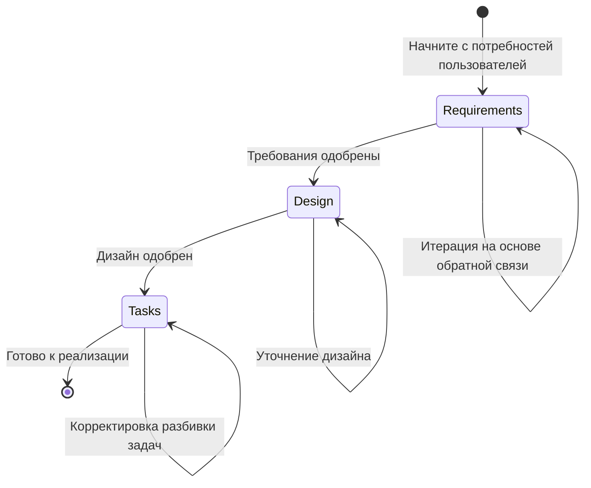

# Руководство по процессу

**📍 Вы здесь:** [Главное руководство](../../README.md) → **Руководство по процессу**

## Быстрая навигация

- **Предварительные условия:** [Обзор методологии](../methodology/README.md) - Сначала поймите основы
- **Шаблоны:** [Готовые к использованию шаблоны](../templates/README.md) - Быстрое начало
- **Примеры:** [Смотрите полные спецификации](../examples/README.md) - Учитесь на реальных примерах
- **Помощь ИИ:** [Стратегии промптинга](../prompting/README.md) - Эффективное сотрудничество с ИИ

---

Пошаговое прохождение трехфазного рабочего процесса разработки на основе спецификаций.

## В этом разделе

- **[Фаза требований](requirements-phase.md)** - Сбор и структурирование требований с использованием формата EARS
- **[Фаза дизайна](design-phase.md)** - Создание комплексных документов дизайна с исследованиями
- **[Фаза задач](tasks-phase.md)** - Разбивка дизайна на выполнимые задачи кодирования
- **[Управление изменениями](change-management.md)** - Управление эволюцией спецификаций и обработка обнаруженных требований
- **[Диаграммы рабочих процессов](workflow-diagrams.md)** - Визуальные потоки процессов и точки принятия решений

## Трехфазный рабочий процесс

Каждая фаза строится на предыдущей, с явными контрольными точками одобрения для обеспечения качества и согласованности перед продолжением.

## Обзор фаз

1. **Требования** - Преобразование грубых идей в структурированные, тестируемые требования
2. **Дизайн** - Исследование и проектирование комплексного решения
3. **Задачи** - Создание выполнимого плана реализации с дискретными шагами кодирования

---

## 🔗 Связанный контент

### Предварительные условия

- [Обзор методологии](../methodology/README.md) - Сначала поймите основы

### Следующие шаги

- [Фаза требований](requirements-phase.md) - Начните трехфазный процесс
- [Шаблоны](../templates/README.md) - Получите готовые к использованию отправные точки

### Связанные разделы

- [Примеры](../examples/README.md) - Смотрите полные примеры процессов
- [Стратегии промптинга](../prompting/README.md) - Получите лучшее сотрудничество с ИИ
- [Руководство по выполнению](../execution/README.md) - Реализуйте ваши завершенные спецификации

[← Назад к главному руководству](../../README.md) | [Начните с требований →](requirements-phase.md)
