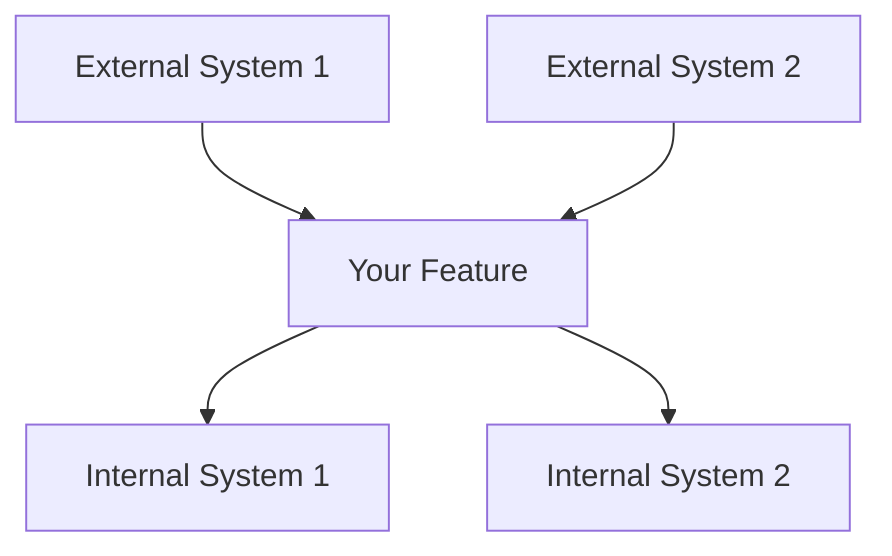
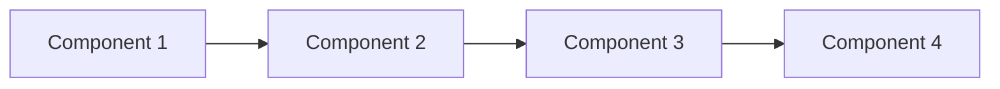
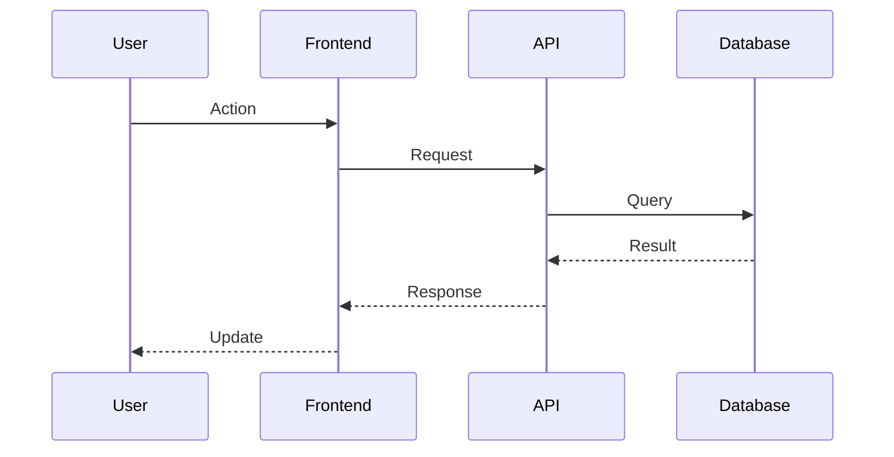
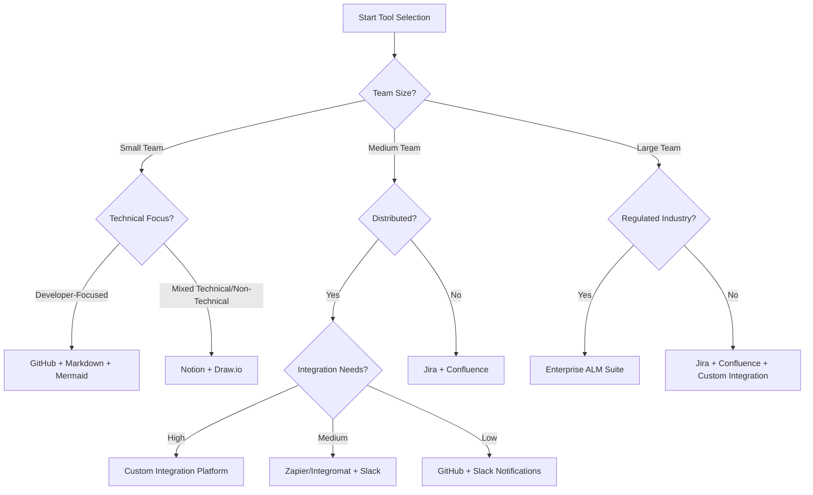

# Tool Integration Guide for Spec Process

This guide provides practical instructions for integrating various tools with the spec-driven development process, focusing on automation, efficiency, and seamless workflows.

## Integrating Tools with the Spec Process

### Requirements Phase Integration

#### Document Management Tools

**GitHub/GitLab Integration**
```bash
# Create spec directory structure
mkdir -p .kiro/specs/my-feature
touch .kiro/specs/my-feature/requirements.md
touch .kiro/specs/my-feature/design.md
touch .kiro/specs/my-feature/tasks.md

# Set up git hooks for validation
cat > .git/hooks/pre-commit << 'EOF'
#!/bin/bash
files=$(git diff --cached --name-only | grep -E "\.kiro/specs/.*/requirements\.md$")
if [ -n "$files" ]; then
  echo "Validating requirements format..."
  ./scripts/validate-requirements.sh $files
  if [ $? -ne 0 ]; then
    echo "Requirements validation failed. Please fix the issues before committing."
    exit 1
  fi
fi
exit 0
EOF
chmod +x .git/hooks/pre-commit
```

**Notion Integration**
```javascript
// Example: Notion API integration to sync requirements
const { Client } = require('@notionhq/client');
const fs = require('fs');
const path = require('path');

const notion = new Client({ auth: process.env.NOTION_API_KEY });

async function syncRequirementsToNotion(requirementsPath, databaseId) {
  const content = fs.readFileSync(requirementsPath, 'utf8');
  const requirements = parseRequirements(content);
  
  for (const req of requirements) {
    await notion.pages.create({
      parent: { database_id: databaseId },
      properties: {
        Name: { title: [{ text: { content: req.title } }] },
        Status: { select: { name: 'Draft' } },
        'User Story': { rich_text: [{ text: { content: req.userStory } }] },
        'Acceptance Criteria': { rich_text: [{ text: { content: req.criteria.join('\n') } }] }
      }
    });
  }
}
```

#### Requirements Validation Tools

**EARS Validator Script**
```python
#!/usr/bin/env python3
# validate-ears.py - Validates EARS format in requirements documents

import re
import sys

def validate_ears(file_path):
    with open(file_path, 'r') as f:
        content = f.read()
    
    # Find all acceptance criteria sections
    criteria_sections = re.findall(r'#### Acceptance Criteria\n\n(.*?)(?=\n\n|\Z)', content, re.DOTALL)
    
    errors = []
    for section in criteria_sections:
        criteria = [c.strip() for c in section.split('\n') if c.strip()]
        for i, criterion in enumerate(criteria):
            # Check EARS format
            if not (re.match(r'^[0-9]+\.\s+WHEN .+ THEN .+ SHALL .+$', criterion) or
                    re.match(r'^[0-9]+\.\s+IF .+ THEN .+ SHALL .+$', criterion) or
                    re.match(r'^[0-9]+\.\s+WHILE .+ .+ SHALL .+$', criterion) or
                    re.match(r'^[0-9]+\.\s+WHERE .+ .+ SHALL .+$', criterion)):
                errors.append(f"Invalid EARS format: {criterion}")
    
    if errors:
        print(f"Validation failed for {file_path}:")
        for error in errors:
            print(f"  - {error}")
        return False
    
    print(f"Validation passed for {file_path}")
    return True

if __name__ == "__main__":
    if len(sys.argv) < 2:
        print("Usage: validate-ears.py <requirements_file>")
        sys.exit(1)
    
    success = validate_ears(sys.argv[1])
    sys.exit(0 if success else 1)
```

### Design Phase Integration

#### Diagramming Tools

**Mermaid Integration**
```javascript
// Example: Generate Mermaid diagrams from design specs
const fs = require('fs');
const path = require('path');

function extractMermaidDiagrams(designPath) {
  const content = fs.readFileSync(designPath, 'utf8');
  const diagrams = [];
  
  // Extract Mermaid code blocks
  const regex = /```mermaid\n([\s\S]*?)\n```/g;
  let match;
  
  while ((match = regex.exec(content)) !== null) {
    diagrams.push(match[1]);
  }
  
  return diagrams;
}

function generateDiagramImages(designPath, outputDir) {
  const diagrams = extractMermaidDiagrams(designPath);
  
  if (!fs.existsSync(outputDir)) {
    fs.mkdirSync(outputDir, { recursive: true });
  }
  
  diagrams.forEach((diagram, index) => {
    const tempFile = path.join(outputDir, `diagram_${index}.mmd`);
    fs.writeFileSync(tempFile, diagram);
    
    // Use mermaid-cli to generate images
    const outputFile = path.join(outputDir, `diagram_${index}.png`);
    execSync(`mmdc -i ${tempFile} -o ${outputFile}`);
    
    console.log(`Generated diagram: ${outputFile}`);
  });
}
```

**Draw.io Integration**
```bash
#!/bin/bash
# sync-diagrams.sh - Syncs Draw.io diagrams with spec repository

SPEC_DIR=".kiro/specs"
DIAGRAMS_DIR="diagrams"

# Ensure diagrams directory exists
mkdir -p "$DIAGRAMS_DIR"

# Find all design documents
find "$SPEC_DIR" -name "design.md" | while read design_file; do
  feature_name=$(basename $(dirname "$design_file"))
  feature_diagrams_dir="$DIAGRAMS_DIR/$feature_name"
  mkdir -p "$feature_diagrams_dir"
  
  # Extract diagram references
  grep -o "!\[.*\](.*\.drawio)" "$design_file" | sed -E 's/!\[.*\]\((.*)\)/\1/' | while read diagram_path; do
    # Copy diagram to central location if it exists
    if [[ -f "$diagram_path" ]]; then
      cp "$diagram_path" "$feature_diagrams_dir/"
      echo "Synced diagram: $diagram_path -> $feature_diagrams_dir/"
    fi
  done
done
```

### Tasks Phase Integration

#### Project Management Integration

**GitHub Issues Integration**
```javascript
// Example: Generate GitHub issues from tasks document
const { Octokit } = require('@octokit/rest');
const fs = require('fs');
const path = require('path');

const octokit = new Octokit({ auth: process.env.GITHUB_TOKEN });

async function createIssuesFromTasks(tasksPath, owner, repo) {
  const content = fs.readFileSync(tasksPath, 'utf8');
  const tasks = parseTasks(content);
  
  for (const task of tasks) {
    // Create GitHub issue
    await octokit.issues.create({
      owner,
      repo,
      title: task.title,
      body: `${task.details}\n\n**Requirements:** ${task.requirements}`,
      labels: ['spec-task']
    });
    
    console.log(`Created issue: ${task.title}`);
  }
}

function parseTasks(content) {
  const tasks = [];
  const regex = /- \[ \] ([0-9.]+) (.*?)\n((?:  - .*\n)*)(  - _Requirements: (.*?)_)/g;
  let match;
  
  while ((match = regex.exec(content)) !== null) {
    const taskNumber = match[1];
    const title = match[2];
    const details = match[3].trim().split('\n').map(line => line.trim().substring(2)).join('\n');
    const requirements = match[5];
    
    tasks.push({
      title: `${taskNumber} ${title}`,
      details,
      requirements
    });
  }
  
  return tasks;
}
```

**Jira Integration**
```python
#!/usr/bin/env python3
# sync-jira.py - Syncs tasks with Jira

import os
import re
import sys
from jira import JIRA

def parse_tasks(tasks_file):
    with open(tasks_file, 'r') as f:
        content = f.read()
    
    tasks = []
    task_pattern = r'- \[ \] ([0-9.]+) (.*?)\n((?:  - .*\n)*)(  - _Requirements: (.*?)_)'
    
    for match in re.finditer(task_pattern, content, re.MULTILINE):
        task_number = match.group(1)
        title = match.group(2)
        details = match.group(3).strip()
        requirements = match.group(5)
        
        tasks.append({
            'key': task_number,
            'title': title,
            'description': details,
            'requirements': requirements
        })
    
    return tasks

def sync_with_jira(tasks, project_key):
    jira = JIRA(
        server=os.environ.get('JIRA_SERVER'),
        basic_auth=(os.environ.get('JIRA_USER'), os.environ.get('JIRA_TOKEN'))
    )
    
    for task in tasks:
        # Check if issue already exists
        existing_issues = jira.search_issues(f'project={project_key} AND summary~"{task["key"]} {task["title"]}"')
        
        if existing_issues:
            issue = existing_issues[0]
            print(f"Updating issue: {issue.key}")
            jira.issue(issue.key).update(
                summary=f"{task['key']} {task['title']}",
                description=f"{task['description']}\n\nRequirements: {task['requirements']}"
            )
        else:
            print(f"Creating issue: {task['key']} {task['title']}")
            jira.create_issue(
                project=project_key,
                summary=f"{task['key']} {task['title']}",
                description=f"{task['description']}\n\nRequirements: {task['requirements']}",
                issuetype={'name': 'Task'}
            )

if __name__ == "__main__":
    if len(sys.argv) < 3:
        print("Usage: sync-jira.py <tasks_file> <jira_project_key>")
        sys.exit(1)
    
    tasks = parse_tasks(sys.argv[1])
    sync_with_jira(tasks, sys.argv[2])
```

### Cross-Phase Integration

#### CI/CD Integration

**GitHub Actions Workflow**
```yaml
# .github/workflows/spec-validation.yml
name: Spec Validation

on:
  push:
    paths:
      - '.kiro/specs/**'
  pull_request:
    paths:
      - '.kiro/specs/**'

jobs:
  validate:
    runs-on: ubuntu-latest
    steps:
      - uses: actions/checkout@v2
      
      - name: Set up Python
        uses: actions/setup-python@v2
        with:
          python-version: '3.x'
          
      - name: Install dependencies
        run: |
          python -m pip install --upgrade pip
          pip install pyyaml markdown
          
      - name: Validate requirements format
        run: |
          python scripts/validate-requirements.py
          
      - name: Check requirements-design traceability
        run: |
          python scripts/check-traceability.py
          
      - name: Generate spec reports
        run: |
          python scripts/generate-spec-report.py
          
      - name: Upload spec reports
        uses: actions/upload-artifact@v2
        with:
          name: spec-reports
          path: reports/
```

**Traceability Checker Script**
```python
#!/usr/bin/env python3
# check-traceability.py - Checks traceability between requirements and design

import os
import re
import sys
import glob

def extract_requirements(req_file):
    with open(req_file, 'r') as f:
        content = f.read()
    
    req_ids = []
    req_pattern = r'### Requirement ([0-9]+)'
    
    for match in re.finditer(req_pattern, content):
        req_ids.append(match.group(1))
    
    return req_ids

def check_design_coverage(design_file, req_ids):
    with open(design_file, 'r') as f:
        content = f.read()
    
    covered_reqs = set()
    for req_id in req_ids:
        if re.search(r'Requirement ' + re.escape(req_id), content):
            covered_reqs.add(req_id)
    
    return covered_reqs

def check_traceability():
    spec_dirs = glob.glob('.kiro/specs/*/')
    
    for spec_dir in spec_dirs:
        req_file = os.path.join(spec_dir, 'requirements.md')
        design_file = os.path.join(spec_dir, 'design.md')
        
        if not os.path.exists(req_file) or not os.path.exists(design_file):
            continue
        
        feature_name = os.path.basename(os.path.dirname(spec_dir))
        print(f"Checking traceability for {feature_name}...")
        
        req_ids = extract_requirements(req_file)
        covered_reqs = check_design_coverage(design_file, req_ids)
        
        missing_reqs = set(req_ids) - covered_reqs
        
        if missing_reqs:
            print(f"  WARNING: The following requirements are not covered in the design:")
            for req_id in missing_reqs:
                print(f"    - Requirement {req_id}")
        else:
            print(f"  All requirements are covered in the design.")

if __name__ == "__main__":
    check_traceability()
```

#### Documentation Generation

**Spec Report Generator**
```python
#!/usr/bin/env python3
# generate-spec-report.py - Generates HTML reports from spec documents

import os
import re
import glob
import markdown
import json
from datetime import datetime

def generate_report():
    spec_dirs = glob.glob('.kiro/specs/*/')
    reports_dir = 'reports'
    
    if not os.path.exists(reports_dir):
        os.makedirs(reports_dir)
    
    index_data = []
    
    for spec_dir in spec_dirs:
        feature_name = os.path.basename(os.path.dirname(spec_dir))
        req_file = os.path.join(spec_dir, 'requirements.md')
        design_file = os.path.join(spec_dir, 'design.md')
        tasks_file = os.path.join(spec_dir, 'tasks.md')
        
        if not os.path.exists(req_file):
            continue
        
        # Generate feature report
        feature_report = {
            'name': feature_name,
            'requirements': os.path.exists(req_file),
            'design': os.path.exists(design_file),
            'tasks': os.path.exists(tasks_file),
            'timestamp': datetime.now().strftime('%Y-%m-%d %H:%M:%S')
        }
        
        # Extract requirements
        if os.path.exists(req_file):
            with open(req_file, 'r') as f:
                req_content = f.read()
            
            feature_report['req_count'] = len(re.findall(r'### Requirement', req_content))
            feature_report['req_html'] = markdown.markdown(req_content)
        
        # Extract design info
        if os.path.exists(design_file):
            with open(design_file, 'r') as f:
                design_content = f.read()
            
            feature_report['design_html'] = markdown.markdown(design_content)
        
        # Extract tasks info
        if os.path.exists(tasks_file):
            with open(tasks_file, 'r') as f:
                tasks_content = f.read()
            
            feature_report['total_tasks'] = len(re.findall(r'- \[ \]', tasks_content))
            feature_report['completed_tasks'] = len(re.findall(r'- \[x\]', tasks_content))
            feature_report['tasks_html'] = markdown.markdown(tasks_content)
        
        # Generate HTML report
        report_html = generate_html_report(feature_report)
        report_path = os.path.join(reports_dir, f"{feature_name}.html")
        
        with open(report_path, 'w') as f:
            f.write(report_html)
        
        print(f"Generated report: {report_path}")
        
        # Add to index
        index_data.append({
            'name': feature_name,
            'req_count': feature_report.get('req_count', 0),
            'total_tasks': feature_report.get('total_tasks', 0),
            'completed_tasks': feature_report.get('completed_tasks', 0),
            'report_url': f"{feature_name}.html"
        })
    
    # Generate index page
    index_html = generate_index_html(index_data)
    index_path = os.path.join(reports_dir, "index.html")
    
    with open(index_path, 'w') as f:
        f.write(index_html)
    
    print(f"Generated index: {index_path}")

def generate_html_report(feature_report):
    # HTML template implementation
    html = f"""<!DOCTYPE html>
<html>
<head>
    <title>{feature_report['name']} - Spec Report</title>
    <style>
        body {{ font-family: Arial, sans-serif; margin: 20px; }}
        h1 {{ color: #333; }}
        .section {{ margin-bottom: 30px; }}
        .progress {{ width: 100%; background-color: #e0e0e0; }}
        .progress-bar {{ height: 20px; background-color: #4CAF50; }}
        .stats {{ display: flex; gap: 20px; }}
        .stat-box {{ padding: 10px; border: 1px solid #ddd; border-radius: 5px; }}
    </style>
</head>
<body>
    <h1>{feature_report['name']} - Spec Report</h1>
    <p>Generated on {feature_report['timestamp']}</p>
    
    <div class="stats">
        <div class="stat-box">
            <h3>Requirements</h3>
            <p>{feature_report.get('req_count', 0)} requirements</p>
        </div>
        <div class="stat-box">
            <h3>Tasks</h3>
            <p>{feature_report.get('completed_tasks', 0)} / {feature_report.get('total_tasks', 0)} completed</p>
        </div>
    </div>
    
    <div class="section">
        <h2>Requirements</h2>
        {feature_report.get('req_html', '<p>No requirements document found.</p>')}
    </div>
    
    <div class="section">
        <h2>Design</h2>
        {feature_report.get('design_html', '<p>No design document found.</p>')}
    </div>
    
    <div class="section">
        <h2>Tasks</h2>
        {feature_report.get('tasks_html', '<p>No tasks document found.</p>')}
    </div>
</body>
</html>"""
    return html

def generate_index_html(index_data):
    features_html = ""
    for feature in index_data:
        task_progress = 0
        if feature.get('total_tasks', 0) > 0:
            task_progress = (feature.get('completed_tasks', 0) / feature.get('total_tasks', 0)) * 100
        
        features_html += f"""
        <tr>
            <td><a href="{feature['report_url']}">{feature['name']}</a></td>
            <td>{feature['req_count']}</td>
            <td>{feature['completed_tasks']} / {feature['total_tasks']}</td>
            <td>
                <div class="progress">
                    <div class="progress-bar" style="width: {task_progress}%;"></div>
                </div>
            </td>
        </tr>
        """
    
    html = f"""<!DOCTYPE html>
<html>
<head>
    <title>Spec Reports</title>
    <style>
        body {{ font-family: Arial, sans-serif; margin: 20px; }}
        h1 {{ color: #333; }}
        table {{ width: 100%; border-collapse: collapse; }}
        th, td {{ padding: 8px; text-align: left; border-bottom: 1px solid #ddd; }}
        th {{ background-color: #f2f2f2; }}
        .progress {{ width: 100%; background-color: #e0e0e0; }}
        .progress-bar {{ height: 20px; background-color: #4CAF50; }}
    </style>
</head>
<body>
    <h1>Spec Reports</h1>
    <p>Generated on {datetime.now().strftime('%Y-%m-%d %H:%M:%S')}</p>
    
    <table>
        <tr>
            <th>Feature</th>
            <th>Requirements</th>
            <th>Tasks</th>
            <th>Progress</th>
        </tr>
        {features_html}
    </table>
</body>
</html>"""
    return html

if __name__ == "__main__":
    generate_report()
```

## Tool Integration Templates

### Requirements Phase Templates

#### Requirements Automation Script
```bash
#!/bin/bash
# create-requirements.sh - Creates a new requirements document from template

if [ $# -lt 1 ]; then
  echo "Usage: $0 <feature-name>"
  exit 1
fi

FEATURE_NAME=$1
SPEC_DIR=".kiro/specs/$FEATURE_NAME"
REQ_FILE="$SPEC_DIR/requirements.md"

# Create directory if it doesn't exist
mkdir -p "$SPEC_DIR"

# Check if requirements file already exists
if [ -f "$REQ_FILE" ]; then
  echo "Requirements file already exists: $REQ_FILE"
  exit 1
fi

# Create requirements file from template
cat > "$REQ_FILE" << 'EOF'
# Requirements Document

## Introduction

[Provide a clear, concise overview of the feature. Explain what problem it solves and why it's needed.]

## Requirements

### Requirement 1

**User Story:** As a [role], I want [feature], so that [benefit].

#### Acceptance Criteria

1. WHEN [event] THEN [system] SHALL [response]
2. IF [condition] THEN [system] SHALL [response]

### Requirement 2

**User Story:** As a [role], I want [feature], so that [benefit].

#### Acceptance Criteria

1. WHEN [event] THEN [system] SHALL [response]
2. IF [condition] THEN [system] SHALL [response]
EOF

echo "Created requirements file: $REQ_FILE"
```

### Design Phase Templates

#### Design Document Generator
```python
#!/usr/bin/env python3
# generate-design.py - Generates design document from requirements

import os
import re
import sys
import datetime

def extract_requirements(req_file):
    with open(req_file, 'r') as f:
        content = f.read()
    
    # Extract introduction
    intro_match = re.search(r'## Introduction\n\n(.*?)(?=\n\n##)', content, re.DOTALL)
    introduction = intro_match.group(1) if intro_match else ""
    
    # Extract requirements
    requirements = []
    req_pattern = r'### Requirement ([0-9]+)\n\n\*\*User Story:\*\* (.*?)\n\n#### Acceptance Criteria\n\n(.*?)(?=\n\n###|\Z)'
    
    for match in re.finditer(req_pattern, content, re.DOTALL):
        req_id = match.group(1)
        user_story = match.group(2)
        criteria = match.group(3)
        
        requirements.append({
            'id': req_id,
            'user_story': user_story,
            'criteria': criteria
        })
    
    return {
        'introduction': introduction,
        'requirements': requirements
    }

def generate_design_doc(feature_name, req_data):
    today = datetime.datetime.now().strftime('%Y-%m-%d')
    
    design = f"""# Design Document

## Overview

{req_data['introduction']}

### Design Goals
- [Primary goal 1]
- [Primary goal 2]
- [Primary goal 3]

### Key Design Decisions
- [Decision 1 and rationale]
- [Decision 2 and rationale]
- [Decision 3 and rationale]

## Architecture

### System Context
[Describe how this feature fits into the broader system. Include external dependencies and integration points.]



### High-Level Architecture
[Describe the overall architectural approach and major components.]



### Technology Stack
| Layer | Technology | Rationale |
|-------|------------|-----------|
| Frontend | [Technology] | [Why chosen] |
| Backend | [Technology] | [Why chosen] |
| Database | [Technology] | [Why chosen] |
| Infrastructure | [Technology] | [Why chosen] |

## Components and Interfaces

"""

    # Add components based on requirements
    for i, req in enumerate(req_data['requirements'], 1):
        design += f"""### Component {i}: [Component Name]

**Purpose**: [What this component does]

**Responsibilities**:
- [Responsibility 1]
- [Responsibility 2]
- [Responsibility 3]

**Interfaces**:
- **Input**: [What it receives]
- **Output**: [What it produces]
- **Dependencies**: [What it depends on]

**Implementation Notes**:
- [Key implementation detail 1]
- [Key implementation detail 2]

**Requirements Addressed**:
- Requirement {req['id']}: {req['user_story']}

"""

    # Add data models section
    design += """## Data Models

### Entity 1: [Entity Name]

```typescript
interface EntityName {
  id: string;
  property1: string;
  property2: number;
  property3: boolean;
  createdAt: Date;
  updatedAt: Date;
}
```

**Validation Rules**:
- [Validation rule 1]
- [Validation rule 2]

**Relationships**:
- [Relationship to other entities]

### Data Flow



## Error Handling

### Error Categories
| Category | HTTP Status | Description | User Action |
|----------|-------------|-------------|-------------|
| Validation | 400 | Invalid input data | Fix input and retry |
| Authentication | 401 | Invalid credentials | Re-authenticate |
| Authorization | 403 | Insufficient permissions | Contact administrator |
| Not Found | 404 | Resource doesn't exist | Check resource identifier |
| Server Error | 500 | Internal system error | Retry later or contact support |

## Testing Strategy

### Unit Testing
- **Coverage Target**: [Percentage]
- **Testing Framework**: [Framework name]
- **Key Test Areas**: [Critical functionality to test]

### Integration Testing
- **API Testing**: [Approach and tools]
- **Database Testing**: [Approach and tools]
- **External Service Testing**: [Mocking strategy]

### End-to-End Testing
- **User Scenarios**: [Key user journeys to test]
- **Testing Tools**: [E2E testing framework]
- **Test Environment**: [Environment setup]
"""

    return design

def main():
    if len(sys.argv) < 2:
        print("Usage: generate-design.py <feature-name>")
        sys.exit(1)
    
    feature_name = sys.argv[1]
    spec_dir = f".kiro/specs/{feature_name}"
    req_file = f"{spec_dir}/requirements.md"
    design_file = f"{spec_dir}/design.md"
    
    if not os.path.exists(req_file):
        print(f"Requirements file not found: {req_file}")
        sys.exit(1)
    
    if os.path.exists(design_file):
        print(f"Design file already exists: {design_file}")
        response = input("Do you want to overwrite it? (y/n): ")
        if response.lower() != 'y':
            sys.exit(0)
    
    req_data = extract_requirements(req_file)
    design_content = generate_design_doc(feature_name, req_data)
    
    with open(design_file, 'w') as f:
        f.write(design_content)
    
    print(f"Generated design document: {design_file}")

if __name__ == "__main__":
    main()
```

### Tasks Phase Templates

#### Task Generator Script
```python
#!/usr/bin/env python3
# generate-tasks.py - Generates tasks document from design and requirements

import os
import re
import sys
import datetime

def extract_components(design_file):
    with open(design_file, 'r') as f:
        content = f.read()
    
    components = []
    component_pattern = r'### Component \d+: \[(.*?)\]\n\n\*\*Purpose\*\*: (.*?)\n\n\*\*Responsibilities\*\*:\n(.*?)\n\n\*\*Interfaces\*\*:'
    
    for match in re.finditer(component_pattern, content, re.DOTALL):
        name = match.group(1)
        purpose = match.group(2)
        responsibilities = re.findall(r'- (.*?)$', match.group(3), re.MULTILINE)
        
        components.append({
            'name': name,
            'purpose': purpose,
            'responsibilities': responsibilities
        })
    
    # Extract requirements addressed by each component
    req_pattern = r'\*\*Requirements Addressed\*\*:\n- Requirement (\d+)'
    for i, component in enumerate(components):
        component_text = re.search(f'### Component {i+1}.*?(?=### Component|\Z)', content, re.DOTALL)
        if component_text:
            req_matches = re.findall(req_pattern, component_text.group(0))
            component['requirements'] = req_matches
    
    return components

def generate_tasks_doc(feature_name, components):
    today = datetime.datetime.now().strftime('%Y-%m-%d')
    
    tasks = f"""# Implementation Plan

## Phase 1: Foundation and Setup

- [ ] 1. Set up project structure and development environment
  - Create directory structure for the feature
  - Set up build configuration and dependencies
  - Configure development tools and linting
  - _Requirements: [Reference specific requirements]_

"""

    task_num = 2
    
    # Add component implementation tasks
    for i, component in enumerate(components):
        tasks += f"""- [ ] {task_num}. Implement {component['name']}
"""
        
        # Add sub-tasks for each component
        subtask_num = 1
        
        # Data model tasks
        tasks += f"""- [ ] {task_num}.{subtask_num} Create data models and interfaces
  - Define TypeScript interfaces for all data models
  - Implement validation functions for data integrity
  - Create unit tests for data model validation
  - _Requirements: {', '.join(component.get('requirements', ['TBD']))}_ 

"""
        subtask_num += 1
        
        # Core functionality tasks
        tasks += f"""- [ ] {task_num}.{subtask_num} Implement core functionality
  - Develop main business logic for {component['name']}
  - Handle edge cases and error conditions
  - Write comprehensive unit tests
  - _Requirements: {', '.join(component.get('requirements', ['TBD']))}_ 

"""
        subtask_num += 1
        
        # Integration tasks
        tasks += f"""- [ ] {task_num}.{subtask_num} Integrate with other components
  - Implement interfaces with dependent components
  - Create integration tests
  - Document integration points
  - _Requirements: {', '.join(component.get('requirements', ['TBD']))}_ 

"""
        
        task_num += 1
    
    # Add testing and documentation tasks
    tasks += f"""- [ ] {task_num}. Implement comprehensive testing
- [ ] {task_num}.1 Create unit test suite
  - Implement tests for all components
  - Set up test automation
  - Ensure adequate code coverage
  - _Requirements: All_

- [ ] {task_num}.2 Implement integration tests
  - Test component interactions
  - Validate end-to-end workflows
  - Test error handling and edge cases
  - _Requirements: All_

- [ ] {task_num+1}. Create documentation
- [ ] {task_num+1}.1 Write API documentation
  - Document all public interfaces
  - Include usage examples
  - Document error responses
  - _Requirements: All_

- [ ] {task_num+1}.2 Update user documentation
  - Document new features
  - Create user guides
  - Update relevant existing documentation
  - _Requirements: All_
"""
    
    return tasks

def main():
    if len(sys.argv) < 2:
        print("Usage: generate-tasks.py <feature-name>")
        sys.exit(1)
    
    feature_name = sys.argv[1]
    spec_dir = f".kiro/specs/{feature_name}"
    design_file = f"{spec_dir}/design.md"
    tasks_file = f"{spec_dir}/tasks.md"
    
    if not os.path.exists(design_file):
        print(f"Design file not found: {design_file}")
        sys.exit(1)
    
    if os.path.exists(tasks_file):
        print(f"Tasks file already exists: {tasks_file}")
        response = input("Do you want to overwrite it? (y/n): ")
        if response.lower() != 'y':
            sys.exit(0)
    
    components = extract_components(design_file)
    tasks_content = generate_tasks_doc(feature_name, components)
    
    with open(tasks_file, 'w') as f:
        f.write(tasks_content)
    
    print(f"Generated tasks document: {tasks_file}")

if __name__ == "__main__":
    main()
```

## Automation Workflows

### Complete Spec Creation Workflow

```bash
#!/bin/bash
# create-spec.sh - Creates a complete spec from scratch

if [ $# -lt 1 ]; then
  echo "Usage: $0 <feature-name>"
  exit 1
fi

FEATURE_NAME=$1
SPEC_DIR=".kiro/specs/$FEATURE_NAME"

# Create directory structure
mkdir -p "$SPEC_DIR"

# Create requirements template
echo "Creating requirements document..."
./scripts/create-requirements.sh "$FEATURE_NAME"

echo ""
echo "Requirements document created at $SPEC_DIR/requirements.md"
echo "Please edit the requirements document and then run:"
echo "  ./scripts/generate-design.py $FEATURE_NAME"
echo "to generate the design document based on your requirements."
```

### Spec Review Workflow

```bash
#!/bin/bash
# review-spec.sh - Runs validation and generates review reports

if [ $# -lt 1 ]; then
  echo "Usage: $0 <feature-name>"
  exit 1
fi

FEATURE_NAME=$1
SPEC_DIR=".kiro/specs/$FEATURE_NAME"
REPORT_DIR="reports/$FEATURE_NAME"

# Create report directory
mkdir -p "$REPORT_DIR"

# Validate requirements
echo "Validating requirements..."
python scripts/validate-requirements.py "$SPEC_DIR/requirements.md" > "$REPORT_DIR/requirements-validation.txt"

# Check traceability
echo "Checking traceability..."
python scripts/check-traceability.py "$FEATURE_NAME" > "$REPORT_DIR/traceability-report.txt"

# Generate review checklists
echo "Generating review checklists..."
python scripts/generate-checklists.py "$FEATURE_NAME" "$REPORT_DIR"

# Generate HTML report
echo "Generating HTML report..."
python scripts/generate-spec-report.py "$FEATURE_NAME" "$REPORT_DIR"

echo ""
echo "Review reports generated in $REPORT_DIR"
echo "Open $REPORT_DIR/index.html to view the complete report."
```

## Integration Best Practices

### Version Control Integration

1. **Branch Strategy**
   - Use feature branches for each spec: `feature/spec-{feature-name}`
   - Create separate branches for each phase: `feature/spec-{feature-name}-requirements`
   - Use pull requests for review and approval

2. **Commit Message Format**
   ```
   [SPEC-{feature}] {phase}: {description}
   
   - Detailed changes
   - References to requirements/design elements
   ```

3. **Git Hooks**
   - Use pre-commit hooks for validation
   - Use post-commit hooks for notifications
   - Use pre-push hooks for comprehensive checks

### Continuous Integration

1. **Automated Validation**
   - Run validation scripts on every commit
   - Generate reports for review
   - Block merges if validation fails

2. **Review Automation**
   - Generate review checklists automatically
   - Track review status in project management tools
   - Notify stakeholders of pending reviews

3. **Documentation Generation**
   - Generate documentation from spec files
   - Keep documentation in sync with code
   - Publish documentation to accessible locations

## Tool Selection Guide

When selecting tools for your spec process, consider the following factors:

### Requirements Phase Tools

| Tool Type | Recommended For | Avoid For |
|-----------|----------------|-----------|
| Markdown Editors | Version-controlled specs, developer-focused teams | Non-technical stakeholders, complex approval workflows |
| Requirement Management Tools | Regulated industries, complex traceability needs | Small teams, simple features |
| Collaboration Platforms | Cross-functional teams, remote collaboration | Security-sensitive projects, offline work |

### Design Phase Tools

| Tool Type | Recommended For | Avoid For |
|-----------|----------------|-----------|
| Diagramming Tools | Visual architecture, component relationships | Text-heavy designs, simple features |
| Modeling Tools | Complex data models, state machines | Rapid prototyping, simple features |
| Design Systems | UI-focused features, consistent interfaces | Backend services, infrastructure features |

### Tasks Phase Tools

| Tool Type | Recommended For | Avoid For |
|-----------|----------------|-----------|
| Project Management | Task tracking, assignment, progress monitoring | Simple features, small teams |
| Issue Trackers | Bug tracking, feature requests | Complex dependencies, resource planning |
| Kanban Boards | Visual workflow, status tracking | Detailed reporting, complex hierarchies |

## Tool Integration Decision Tree



---

[← Tools Reference](tools.md) | [Checklists →](../templates/checklists.md) | [Back to Resources](README.md)