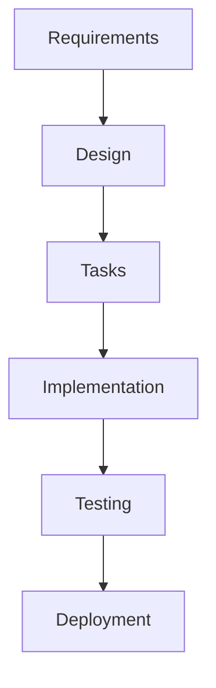

# Руководство по инструментам и интеграции

Это руководство предоставляет рекомендации по инструментам, платформам и интеграциям, которые поддерживают процесс разработки на основе спецификаций.

## Инструменты документации

### Редакторы и платформы Markdown

#### GitHub/GitLab

**Лучше всего подходит для**: Документация с контролем версий, командная работа

**Возможности**:

- Нативная поддержка рендеринга Markdown
- Обзоры pull request для документации
- Интеграция с отслеживанием задач
- Функциональность Wiki
- Поддержка диаграмм Mermaid

**Советы по интеграции**:

- Храните спецификации в структуре каталогов `.kiro/specs/`
- Используйте защиту веток для обзоров спецификаций
- Связывайте задачи с конкретными требованиями
- Используйте GitHub Pages для опубликованной документации

#### Notion

**Лучше всего подходит для**: Богатое форматирование, интеграция с базами данных, командные вики

**Возможности**:

- Редактирование богатого текста с экспортом в Markdown
- Представления базы данных для отслеживания требований
- Система шаблонов для согласованного форматирования
- Совместная работа в реальном времени
- Интеграция с инструментами управления проектами

**Советы по интеграции**:

- Создавайте шаблонные страницы для каждой фазы спецификации
- Используйте базы данных для отслеживания статуса требований
- Связывайте связанные страницы для перекрестных ссылок
- Экспортируйте в Markdown для контроля версий

#### Obsidian

**Лучше всего подходит для**: Графы знаний, перекрестные ссылки, управление личными знаниями

**Возможности**:

- Двунаправленные ссылки между документами
- Граф-представление для связей требований
- Экосистема плагинов для расширенной функциональности
- Локальное хранение файлов с опциями синхронизации
- Расширенный поиск и фильтрация

**Советы по интеграции**:

- Используйте теги для категоризации требований
- Создавайте шаблоны для согласованной структуры
- Используйте граф-представление для анализа зависимостей
- Используйте ежедневные заметки для прогресса разработки спецификаций

#### Confluence

**Лучше всего подходит для**: Корпоративная документация, структурированное управление контентом

**Возможности**:

- Корпоративная совместная работа
- Расширенные разрешения и рабочие процессы
- Система шаблонов и макросов
- Интеграция с набором Atlassian
- Расширенный поиск и отчетность

**Советы по интеграции**:

- Создавайте шаблоны пространств для проектов спецификаций
- Используйте шаблоны страниц для согласованного форматирования
- Используйте макросы для динамического контента
- Интегрируйте с Jira для отслеживания требований

### Инструменты диаграммирования

#### Mermaid

**Лучше всего подходит для**: Диаграммы на основе кода, интеграция с контролем версий

**Поддерживаемые диаграммы**:

- Блок-схемы для потоков процессов
- Диаграммы последовательности для взаимодействий
- Диаграммы классов для моделей данных
- Диаграммы состояний для поведения системы
- Диаграммы Ганта для временных рамок проекта

**Пример использования**:



**Советы по интеграции**:

- Встраивайте напрямую в документы Markdown
- Используйте согласованный стиль для всех диаграмм
- Контролируйте версии исходного кода диаграмм
- Генерируйте документацию из диаграмм

#### Lucidchart

**Лучше всего подходит для**: Сложные системные диаграммы, совместный дизайн

**Возможности**:

- Профессиональные инструменты диаграммирования
- Совместная работа в реальном времени
- Библиотека шаблонов
- Интеграция с платформами документации
- Расширенное стилизование и форматирование

**Советы по интеграции**:

- Создавайте шаблоны диаграмм для общих паттернов
- Используйте общие папки для доступа команды
- Экспортируйте диаграммы для встраивания в документацию
- Связывайте диаграммы с конкретными требованиями

#### Draw.io (теперь diagrams.net)

**Лучше всего подходит для**: Бесплатное диаграммирование, автономная работа

**Возможности**:

- Бесплатный и с открытым исходным кодом
- Веб-версия и настольная версия
- Интеграция с облачным хранилищем
- Обширные библиотеки фигур
- Экспорт в несколько форматов

**Советы по интеграции**:

- Сохраняйте диаграммы в репозиториях проекта
- Используйте согласованные соглашения об именовании
- Создавайте пользовательские библиотеки фигур
- Экспортируйте как SVG для масштабируемого встраивания

## Управление проектами и отслеживание

### Linear

**Лучше всего подходит для**: Современное управление проектами, рабочие процессы, ориентированные на разработчиков

**Возможности**:

- Чистый, быстрый интерфейс
- Интеграция с Git
- Автоматизированные рабочие процессы
- Отслеживание требований
- Планирование спринтов

**Интеграция со спецификациями**:

- Создавайте задачи из требований
- Связывайте задачи с конкретными критериями приемки
- Отслеживайте прогресс реализации
- Генерируйте отчеты о завершении спецификаций

**Советы по настройке**:

- Создавайте метки для фаз спецификаций (Требования, Дизайн, Задачи)
- Используйте пользовательские поля для трассируемости требований
- Настройте автоматизацию для обновлений статуса
- Создавайте представления для разных заинтересованных сторон

### Jira

**Лучше всего подходит для**: Корпоративное управление проектами, сложные рабочие процессы

**Возможности**:

- Настраиваемые рабочие процессы
- Расширенная отчетность
- Экосистема интеграций
- Управление требованиями
- Инструменты гибкого планирования

**Интеграция со спецификациями**:

- Создавайте эпики для каждого основного требования
- Разбивайте эпики на пользовательские истории
- Связывайте истории с критериями приемки
- Отслеживайте прогресс через пользовательские панели

**Советы по настройке**:

- Создавайте пользовательские типы задач для требований
- Используйте компоненты для организации по областям функций
- Настройте пользовательские поля для отслеживания EARS
- Создавайте панели для прогресса спецификаций

### GitHub Issues/Projects

**Лучше всего подходит для**: Управление проектами, интегрированное с кодом, проекты с открытым исходным кодом

**Возможности**:

- Нативная интеграция с Git
- Панели проектов и автоматизация
- Шаблоны задач
- Отслеживание вех
- Интеграция с pull request

**Интеграция со спецификациями**:

- Создавайте шаблоны задач для требований
- Используйте панели проектов для фаз спецификаций
- Связывайте pull request с требованиями
- Отслеживайте завершение через вехи

**Советы по настройке**:

- Создавайте метки для типов требований
- Используйте шаблоны задач для согласованности
- Настройте правила автоматизации проектов
- Связывайте задачи с конкретными изменениями кода

### Trello

**Лучше всего подходит для**: Простые канбан-доски, визуальное управление проектами

**Возможности**:

- Визуальные канбан-доски
- Организация на основе карточек
- Расширения для дополнительной функциональности
- Командная работа
- Мобильные приложения

**Интеграция со спецификациями**:

- Создавайте доски для каждой фазы спецификации
- Используйте карточки для отдельных требований
- Добавляйте чек-листы для критериев приемки
- Перемещайте карточки через этапы рабочего процесса

**Советы по настройке**:

- Создавайте шаблоны досок для новых спецификаций
- Используйте метки для приоритета требований
- Добавляйте сроки для отслеживания вех
- Используйте расширения для отслеживания времени

## Инструменты управления требованиями

### Azure DevOps

**Лучше всего подходит для**: Корпоративное управление требованиями, экосистема Microsoft

**Возможности**:

- Отслеживание рабочих элементов
- Иерархия требований
- Матрица трассируемости
- Управление тестовыми случаями
- Интеграция с инструментами разработки

**Интеграция со спецификациями**:

- Создавайте типы рабочих элементов для требований
- Стройте иерархии требований
- Связывайте требования с тестовыми случаями
- Генерируйте отчеты трассируемости

### IBM DOORS

**Лучше всего подходит для**: Регулируемые отрасли, сложная трассируемость требований

**Возможности**:

- Формальное управление требованиями
- Анализ воздействия изменений
- Управление базовыми линиями
- Отчетность о соответствии
- Интеграция с инструментами тестирования

**Интеграция со спецификациями**:

- Импортируйте требования из спецификаций
- Поддерживайте базовые линии требований
- Отслеживайте изменения требований
- Генерируйте отчеты о соответствии

### Aha

**Лучше всего подходит для**: Управление продуктом, планирование дорожной карты

**Возможности**:

- Управление дорожной картой продукта
- Приоритизация функций
- Коммуникация с заинтересованными сторонами
- Интеграция с инструментами разработки
- Стратегическое планирование

**Интеграция со спецификациями**:

- Создавайте функции из требований
- Приоритизируйте на основе бизнес-ценности
- Коммуницируйте дорожную карту с заинтересованными сторонами
- Отслеживайте доставку функций

## Инструменты тестирования и обеспечения качества

### Управление тестированием

#### TestRail

**Лучше всего подходит для**: Комплексное управление тестированием, трассируемость требований

**Возможности**:

- Управление тестовыми случаями
- Отслеживание выполнения тестов
- Анализ покрытия требований
- Отчетность и аналитика
- Интеграция с отслеживанием ошибок

**Интеграция со спецификациями**:

- Создавайте тестовые случаи из критериев приемки
- Отслеживайте покрытие требований
- Связывайте результаты тестов с требованиями
- Генерируйте отчеты о покрытии

#### Zephyr

**Лучше всего подходит для**: Интеграция с Jira, гибкое тестирование

**Возможности**:

- Нативная интеграция с Jira
- Создание и выполнение тестовых случаев
- Отчетность в реальном времени
- Матрица трассируемости
- Интеграция с автоматизацией

**Интеграция со спецификациями**:

- Связывайте тестовые случаи с задачами требований
- Отслеживайте прогресс тестирования в Jira
- Генерируйте отчеты о покрытии требований
- Интегрируйте с конвейерами CI/CD

### Автоматизированное тестирование

#### Jest/Vitest

**Лучше всего подходит для**: Модульное тестирование JavaScript/TypeScript

**Советы по интеграции**:

- Называйте файлы тестов в соответствии с требованиями
- Используйте блоки describe для группировки требований
- Включайте идентификаторы требований в описания тестов
- Генерируйте отчеты о покрытии для требований

#### Cypress/Playwright

**Лучше всего подходит для**: Сквозное тестирование, валидация пользовательских сценариев

**Советы по интеграции**:

- Создавайте тестовые сценарии из пользовательских историй
- Используйте атрибуты данных для трассируемости требований
- Генерируйте отчеты о тестах с сопоставлением требований
- Интегрируйте с CI/CD для непрерывной валидации

#### Postman/Insomnia

**Лучше всего подходит для**: Тестирование API, валидация интеграции

**Советы по интеграции**:

- Создавайте коллекции тестов для требований API
- Используйте переменные окружения для разных тестовых сценариев
- Генерируйте документацию API из тестов
- Интегрируйте с CI/CD для автоматизированного тестирования API

## Инструменты разработки и качества кода

### Качество кода

#### SonarQube

**Лучше всего подходит для**: Анализ качества кода, управление техническим долгом

**Возможности**:

- Статический анализ кода
- Обнаружение уязвимостей безопасности
- Отслеживание покрытия кода
- Оценка технического долга
- Принуждение к качественным воротам

**Интеграция со спецификациями**:

- Устанавливайте качественные ворота на основе требований
- Отслеживайте покрытие кода для реализации требований
- Мониторьте введение технического долга
- Генерируйте отчеты о качестве для заинтересованных сторон

#### ESLint/Prettier

**Лучше всего подходит для**: Форматирование кода и линтинг

**Советы по интеграции**:

- Настраивайте правила на основе стандартов проекта
- Интегрируйте с CI/CD для автоматизированных проверок
- Используйте pre-commit хуки для согласованности
- Генерируйте отчеты для метрик качества кода

### Контроль версий

#### Git Workflows

**Лучше всего подходит для**: Версионирование кода, совместная работа

**Стратегии интеграции со спецификациями**:

- **Ветки функций**: Создавайте ветки для каждого требования
- **Сообщения коммитов**: Ссылайтесь на идентификаторы требований в коммитах
- **Pull Requests**: Связывайте PR с конкретными требованиями
- **Теги**: Тегируйте релизы с завершением требований

**Соглашения об именовании веток**:

- `feature/req-1.1-user-authentication`
- `bugfix/req-2.3-validation-error`
- `docs/req-update-api-spec`

## Инструменты CI/CD и автоматизации

### Непрерывная интеграция

#### GitHub Actions

**Лучше всего подходит для**: CI/CD, интегрированный с GitHub, автоматизация рабочих процессов

**Интеграция со спецификациями**:

- Запускайте сборки при изменениях, связанных с требованиями
- Запускайте тесты для конкретных областей требований
- Генерируйте отчеты о завершении требований
- Автоматизируйте развертывание на основе статуса требований

**Пример рабочего процесса**:

```yaml
name: Requirement Validation
on:
  pull_request:
    paths:
      - 'src/requirements/**'
jobs:
  validate:
    runs-on: ubuntu-latest
    steps:
      - uses: actions/checkout@v2
      - name: Run requirement tests
        run: npm test -- --grep "Requirement"
```

#### Jenkins

**Лучше всего подходит для**: Корпоративный CI/CD, сложные конвейеры

**Интеграция со спецификациями**:

- Создавайте конвейеры для валидации требований
- Интегрируйте с инструментами тестирования
- Генерируйте отчеты о завершении требований
- Автоматизируйте развертывание на основе качественных ворот

#### GitLab CI

**Лучше всего подходит для**: CI/CD, интегрированный с GitLab, DevOps рабочие процессы

**Интеграция со спецификациями**:

- Используйте шаблоны merge request для обзоров требований
- Создавайте конвейеры для тестирования требований
- Генерируйте отчеты о покрытии
- Автоматизируйте обновления статуса требований

## Инструменты коммуникации и совместной работы

### Командная коммуникация

#### Slack

**Лучше всего подходит для**: Командная коммуникация в реальном времени, центр интеграции

**Интеграция со спецификациями**:

- Создавайте каналы для обсуждений спецификаций
- Используйте ботов для обновлений статуса требований
- Интегрируйте с инструментами управления проектами
- Делитесь прогрессом и обновлениями спецификаций

**Интеграции ботов**:

- Уведомления GitHub/GitLab об изменениях спецификаций
- Обновления Jira/Linear о прогрессе требований
- Напоминания календаря об обзорах спецификаций
- Пользовательские боты для запросов требований

#### Microsoft Teams

**Лучше всего подходит для**: Корпоративная коммуникация, экосистема Microsoft

**Интеграция со спецификациями**:

- Создавайте команды для разработки спецификаций
- Используйте каналы для разных фаз спецификаций
- Интегрируйте с Azure DevOps
- Делитесь документами и сотрудничайте над спецификациями

#### Discord

**Лучше всего подходит для**: Проекты, управляемые сообществом, неформальная коммуникация

**Интеграция со спецификациями**:

- Создавайте каналы для обсуждений спецификаций
- Используйте ботов для автоматизированных обновлений
- Делитесь прогрессом и получайте обратную связь
- Координируйте деятельность по разработке

### Обзор и утверждение

#### ReviewBoard

**Лучше всего подходит для**: Рабочие процессы обзора кода и документов

**Возможности**:

- Рабочие процессы обзора документов
- Отслеживание комментариев и утверждений
- Интеграция с контролем версий
- Аналитика и отчетность обзоров

**Интеграция со спецификациями**:

- Обзор документов требований
- Отслеживание статуса утверждения
- Управление обратной связью обзора
- Генерация отчетов обзора

#### Collaborator

**Лучше всего подходит для**: Корпоративный обзор кода и документов

**Возможности**:

- Формальные процессы обзора
- Отчетность о соответствии
- Интеграция с инструментами разработки
- Расширенная аналитика

**Интеграция со спецификациями**:

- Формальные процессы обзора спецификаций
- Отслеживание соответствия
- Метрики и отчетность обзора
- Интеграция с качественными воротами

## Инструменты мониторинга и аналитики

### Мониторинг приложений

#### DataDog

**Лучше всего подходит для**: Мониторинг производительности приложений, наблюдаемость

**Интеграция со спецификациями**:

- Мониторьте метрики, специфичные для требований
- Создавайте панели для производительности функций
- Настраивайте оповещения о нарушениях требований
- Отслеживайте поведение пользователей для валидации требований

#### New Relic

**Лучше всего подходит для**: Мониторинг производительности приложений, пользовательский опыт

**Интеграция со спецификациями**:

- Мониторьте метрики производительности функций
- Отслеживайте взаимодействие пользователей с новыми функциями
- Настраивайте оповещения для требований производительности
- Генерируйте отчеты о соответствии требованиям

### Аналитика и отчетность

#### Google Analytics

**Лучше всего подходит для**: Отслеживание поведения пользователей, анализ использования функций

**Интеграция со спецификациями**:

- Отслеживайте использование новых функций
- Измеряйте метрики успеха требований
- Анализируйте паттерны поведения пользователей
- Генерируйте отчеты о внедрении функций

#### Mixpanel

**Лучше всего подходит для**: Аналитика продукта, отслеживание событий

**Интеграция со спецификациями**:

- Отслеживайте события, специфичные для требований
- Измеряйте метрики успеха функций
- Анализируйте вовлеченность пользователей
- Генерируйте отчеты о производительности требований

## Стратегии интеграции инструментов

### Интеграция рабочих процессов

#### Единый источник истины

- Выберите один основной инструмент для хранения требований
- Синхронизируйте данные между инструментами с помощью API
- Поддерживайте согласованность между платформами
- Установите четкое владение данными

#### Интеграция API

- Используйте webhooks для обновлений в реальном времени
- Реализуйте пользовательские интеграции там, где необходимо
- Используйте существующие платформы интеграции
- Мониторьте здоровье и производительность интеграций

#### Автоматизированные рабочие процессы

- Автоматизируйте обновления статуса между инструментами
- Создавайте триггеры для изменений требований
- Генерируйте отчеты автоматически
- Уведомляйте заинтересованные стороны о важных обновлениях

### Лучшие практики

#### Критерии выбора инструментов

- **Размер команды**: Выбирайте инструменты, которые масштабируются с вашей командой
- **Бюджет**: Учитывайте соотношение стоимости и ценности для вашей организации
- **Интеграция**: Убедитесь, что инструменты хорошо работают вместе
- **Кривая обучения**: Учитывайте время внедрения и потребности в обучении
- **Поддержка**: Оценивайте поддержку поставщика и сообщество

#### Стратегия внедрения

1. **Начните с малого**: Начните с основных инструментов и расширяйтесь постепенно
2. **Пилотные программы**: Сначала протестируйте инструменты с небольшими командами
3. **Обучение**: Обеспечьте адекватное обучение для членов команды
4. **Обратная связь**: Собирайте обратную связь и итерируйте использование инструментов
5. **Оптимизация**: Постоянно оптимизируйте рабочие процессы и интеграции

#### Обслуживание и обновления

- Регулярно пересматривайте эффективность инструментов
- Поддерживайте интеграции обновленными и безопасными
- Мониторьте использование и внедрение инструментов
- Планируйте миграции и обновления инструментов
- Поддерживайте документацию по использованию инструментов

---

## Матрица сравнения инструментов

| Категория | Инструмент | Лучше всего для | Стоимость | Кривая обучения | Интеграция |
|-----------|------------|-----------------|-----------|-----------------|------------|
| Документация | GitHub | Контроль версий | Бесплатно/Платно | Низкая | Отличная |
| Документация | Notion | Богатое форматирование | Платно | Средняя | Хорошая |
| Документация | Confluence | Корпоративная | Платно | Средняя | Отличная |
| Управление проектами | Linear | Современные команды | Платно | Низкая | Хорошая |
| Управление проектами | Jira | Корпоративная | Платно | Высокая | Отличная |
| Управление проектами | GitHub Projects | Интеграция с кодом | Бесплатно/Платно | Низкая | Отличная |
| Диаграммирование | Mermaid | На основе кода | Бесплатно | Средняя | Отличная |
| Диаграммирование | Lucidchart | Профессиональное | Платно | Низкая | Хорошая |
| Тестирование | Jest | Модульное тестирование | Бесплатно | Средняя | Хорошая |
| Тестирование | Cypress | E2E тестирование | Бесплатно/Платно | Средняя | Хорошая |
| CI/CD | GitHub Actions | Интеграция с GitHub | Бесплатно/Платно | Средняя | Отличная |
| CI/CD | Jenkins | Корпоративная | Бесплатно | Высокая | Хорошая |

## Рекомендуемые стеки инструментов

### Стек для стартапов/малых команд

**Бюджет**: Низкий-средний  
**Размер команды**: 2-10 разработчиков  
**Сложность**: Низкая-средняя

**Основные инструменты**:

- **Документация**: GitHub + Markdown
- **Управление проектами**: Linear или GitHub Projects
- **Диаграммирование**: Mermaid (встроенный в документы)
- **Тестирование**: Jest + Cypress
- **CI/CD**: GitHub Actions
- **Коммуникация**: Slack

**Общая стоимость**: $50-200/месяц  
**Время настройки**: 1-2 дня  
**Кривая обучения**: Низкая

**Плюсы**:

- Интегрированная экосистема
- Низкая стоимость и сложность
- Быстрая настройка и внедрение
- Хорошо для команд, ориентированных на код

**Минусы**:

- Ограниченные расширенные функции
- Может не масштабироваться до больших команд
- Меньше корпоративных интеграций

### Корпоративный стек

**Бюджет**: Высокий  
**Размер команды**: 50+ разработчиков  
**Сложность**: Высокая

**Основные инструменты**:

- **Документация**: Confluence + SharePoint
- **Управление проектами**: Jira + Azure DevOps
- **Требования**: IBM DOORS или Azure DevOps
- **Диаграммирование**: Lucidchart + Visio
- **Тестирование**: TestRail + Selenium Grid
- **CI/CD**: Jenkins + Azure Pipelines
- **Коммуникация**: Microsoft Teams

**Общая стоимость**: $500-2000/месяц  
**Время настройки**: 2-4 недели  
**Кривая обучения**: Высокая

**Плюсы**:

- Корпоративные функции
- Расширенная отчетность и аналитика
- Поддержка соответствия и аудита
- Обширные опции интеграции

**Минусы**:

- Высокая стоимость и сложность
- Длительное время настройки и обучения
- Может быть избыточным для небольших проектов

### Гибридный/современный стек

**Бюджет**: Средний  
**Размер команды**: 10-50 разработчиков  
**Сложность**: Средняя

**Основные инструменты**:

- **Документация**: Notion + GitHub
- **Управление проектами**: Linear + Jira (для сложных проектов)
- **Диаграммирование**: Mermaid + Lucidchart
- **Тестирование**: Jest + Playwright + TestRail
- **CI/CD**: GitHub Actions + Jenkins
- **Коммуникация**: Slack + Microsoft Teams

**Общая стоимость**: $200-800/месяц  
**Время настройки**: 1 неделя  
**Кривая обучения**: Средняя

**Плюсы**:

- Баланс функций и стоимости
- Гибкость и адаптируемость
- Хорошие опции интеграции
- Масштабируется с ростом команды

**Минусы**:

- Требует больше управления инструментами
- Потенциальная сложность интеграции
- Может потребовать пользовательских решений

## Фреймворк выбора инструментов

### Критерии оценки

#### Функциональные требования

1. **Основные функции**: Предоставляет ли инструмент необходимую функциональность?
2. **Интеграция**: Насколько хорошо он интегрируется с существующими инструментами?
3. **Масштабируемость**: Может ли он расти вместе с вашей командой и проектами?
4. **Настройка**: Можно ли его адаптировать к вашим конкретным потребностям?
5. **Отчетность**: Предоставляет ли он необходимую аналитику и отчетность?

#### Нефункциональные требования

1. **Производительность**: Быстрый ли и отзывчивый инструмент?
2. **Надежность**: Стабилен ли он и доступен, когда нужен?
3. **Безопасность**: Соответствует ли он вашим требованиям безопасности?
4. **Удобство использования**: Легко ли его изучить и использовать?
5. **Поддержка**: Какой уровень поддержки доступен?

#### Бизнес-соображения

1. **Стоимость**: Общая стоимость владения, включая лицензии, обучение, обслуживание
2. **ROI**: Ожидаемая окупаемость инвестиций и прирост производительности
3. **Риск**: Стабильность поставщика, проблемы с привязкой, сложность миграции
4. **Соответствие**: Требования соответствия нормативным актам и политикам
5. **Временные рамки**: Временные рамки внедрения и требования к ресурсам

### Шаблон матрицы решений

| Инструмент | Основные функции | Интеграция | Масштабируемость | Стоимость | Удобство использования | Общий балл |
|------------|------------------|------------|------------------|-----------|------------------------|------------|
| Вариант 1 | 8/10 | 7/10 | 9/10 | 6/10 | 8/10 | 38/50 |
| Вариант 2 | 9/10 | 8/10 | 7/10 | 8/10 | 7/10 | 39/50 |
| Вариант 3 | 7/10 | 9/10 | 8/10 | 7/10 | 9/10 | 40/50 |

### Дорожная карта внедрения

#### Фаза 1: Основа (Недели 1-2)

- Настройте основную платформу документации
- Настройте базовое управление проектами
- Установите каналы командной коммуникации
- Создайте начальные шаблоны и рабочие процессы

#### Фаза 2: Улучшение (Недели 3-4)

- Добавьте инструменты диаграммирования и визуализации
- Внедрите инструменты тестирования и обеспечения качества
- Настройте базовую автоматизацию и CI/CD
- Обучите команду новым инструментам и процессам

#### Фаза 3: Оптимизация (Недели 5-8)

- Интегрируйте расширенные функции и настройки
- Внедрите комплексный мониторинг и отчетность
- Оптимизируйте рабочие процессы и автоматизацию
- Собирайте обратную связь и итерируйте процессы

#### Фаза 4: Масштабирование (Постоянно)

- Добавляйте дополнительные инструменты по мере необходимости
- Масштабируйте процессы для больших команд
- Внедряйте расширенные интеграции
- Постоянно улучшайте и оптимизируйте

## Паттерны интеграции и лучшие практики

### Паттерны интеграции API

#### Интеграция на основе webhooks

```javascript
// Пример: GitHub webhook для обновления инструмента управления проектами
app.post('/webhook/github', (req, res) => {
  const { action, pull_request } = req.body;
  
  if (action === 'opened' && pull_request.title.includes('[REQ-')) {
    // Извлеките идентификатор требования из заголовка PR
    const reqId = pull_request.title.match(/\[REQ-(\d+\.\d+)\]/)[1];
    
    // Обновите инструмент управления проектами
    await updateTaskStatus(reqId, 'in_progress');
  }
  
  res.status(200).send('OK');
});
```

#### Интеграция на основе опроса

```javascript
// Пример: Синхронизация статуса требований между инструментами
async function syncRequirementStatus() {
  const requirements = await getRequirementsFromSource();
  
  for (const req of requirements) {
    const currentStatus = await getStatusFromProjectTool(req.id);
    const expectedStatus = await getStatusFromRequirementTool(req.id);
    
    if (currentStatus !== expectedStatus) {
      await updateStatus(req.id, expectedStatus);
    }
  }
}

// Запускать каждые 15 минут
setInterval(syncRequirementStatus, 15 * 60 * 1000);
```

#### Событийно-ориентированная интеграция

```javascript
// Пример: Шина событий для интеграции инструментов
class SpecEventBus {
  constructor() {
    this.subscribers = new Map();
  }
  
  subscribe(event, handler) {
    if (!this.subscribers.has(event)) {
      this.subscribers.set(event, []);
    }
    this.subscribers.get(event).push(handler);
  }
  
  publish(event, data) {
    const handlers = this.subscribers.get(event) || [];
    handlers.forEach(handler => handler(data));
  }
}

// Использование
const eventBus = new SpecEventBus();

eventBus.subscribe('requirement.updated', async (data) => {
  await updateProjectManagementTool(data);
  await notifyStakeholders(data);
  await updateDocumentation(data);
});
```

### Стратегии синхронизации данных

#### Паттерн Master-Slave

- Один инструмент служит основным источником истины
- Другие инструменты синхронизируются с мастером
- Простота реализации и обслуживания
- Риск потери данных при отказе мастера

#### Паттерн Multi-Master

- Несколько инструментов могут обновлять одни и те же данные
- Требуются механизмы разрешения конфликтов
- Более сложный, но более устойчивый
- Лучше для распределенных команд

#### Паттерн Event Sourcing

- Все изменения хранятся как события
- Инструменты воспроизводят события для построения текущего состояния
- Отличный аудиторский след и отладка
- Более сложная реализация

### Автоматизированные рабочие процессы

#### Автоматизация жизненного цикла требований

```yaml
# GitHub Actions рабочий процесс для обновлений требований
name: Requirement Lifecycle
on:
  push:
    paths:
      - '.kiro/specs/*/requirements.md'

jobs:
  validate-requirements:
    runs-on: ubuntu-latest
    steps:
      - uses: actions/checkout@v2
      - name: Validate EARS format
        run: |
          python scripts/validate_ears.py
      - name: Update project management
        run: |
          python scripts/sync_requirements.py
      - name: Notify stakeholders
        run: |
          python scripts/notify_stakeholders.py
```

#### Автоматизация интеграции тестирования

```yaml
# Автоматизированное тестирование на основе требований
name: Requirement Testing
on:
  pull_request:
    types: [opened, synchronize]

jobs:
  test-requirements:
    runs-on: ubuntu-latest
    steps:
      - uses: actions/checkout@v2
      - name: Extract requirement IDs
        id: extract
        run: |
          echo "::set-output name=req_ids::$(grep -o 'REQ-[0-9]\+\.[0-9]\+' ${{ github.event.pull_request.body }})"
      - name: Run requirement-specific tests
        run: |
          npm test -- --grep "${{ steps.extract.outputs.req_ids }}"
```

## Соображения безопасности и соответствия

### Защита данных

- **Шифрование**: Обеспечьте шифрование данных при передаче и хранении
- **Контроль доступа**: Реализуйте контроль доступа на основе ролей
- **Аудиторское логирование**: Ведите комплексные аудиторские журналы
- **Хранение данных**: Реализуйте соответствующие политики хранения данных

### Требования соответствия

- **GDPR**: Убедитесь, что инструменты соответствуют нормативным актам о защите данных
- **SOX**: Ведите аудиторские следы для финансового соответствия
- **HIPAA**: Защищайте медицинскую информацию, если применимо
- **Отраслевые стандарты**: Следуйте соответствующим отраслевым стандартам

### Лучшие практики безопасности

- **Аутентификация**: Используйте надежные механизмы аутентификации
- **Авторизация**: Реализуйте доступ с минимальными привилегиями
- **Сетевая безопасность**: Защищайте сетевые коммуникации
- **Управление уязвимостями**: Регулярные оценки безопасности

## Стратегии оптимизации затрат

### Управление лицензиями

- **Лицензирование на основе пользователей**: Оптимизируйте назначения пользователей
- **Лицензирование на основе функций**: Платите только за необходимые функции
- **Скидки за объем**: Договаривайтесь о лучших тарифах для больших команд
- **Годовые vs месячные**: Рассмотрите годовые обязательства для экономии

### Оптимизация ресурсов

- **Облако vs локально**: Оцените общую стоимость владения
- **Общие ресурсы**: Делитесь инструментами между несколькими проектами
- **Автоматизация**: Сокращайте ручной труд через автоматизацию
- **Обучение**: Инвестируйте в обучение для повышения эффективности

### Измерение ROI

- **Метрики производительности**: Измеряйте улучшения скорости разработки
- **Метрики качества**: Отслеживайте сокращение дефектов и улучшения качества
- **Экономия времени**: Количественно оценивайте время, сэкономленное через автоматизацию
- **Избежание затрат**: Рассчитывайте затраты, избежанные через лучшие процессы

---

[← Стандарты](standards.md) | [Чек-листы →](../templates/checklists.md) | [Назад к ресурсам](README.md)
