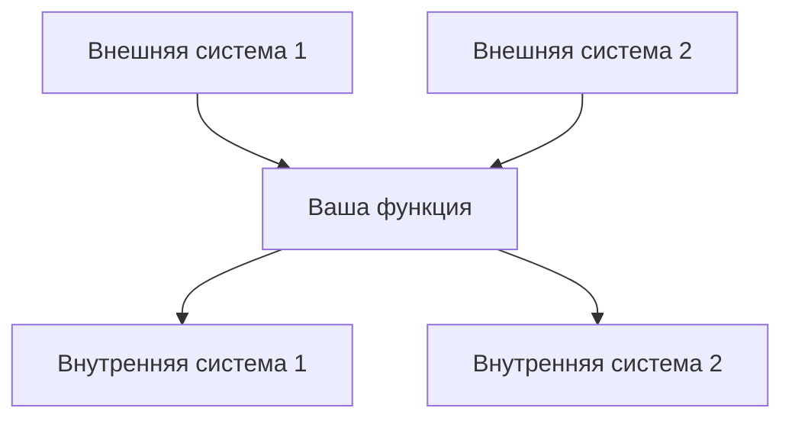
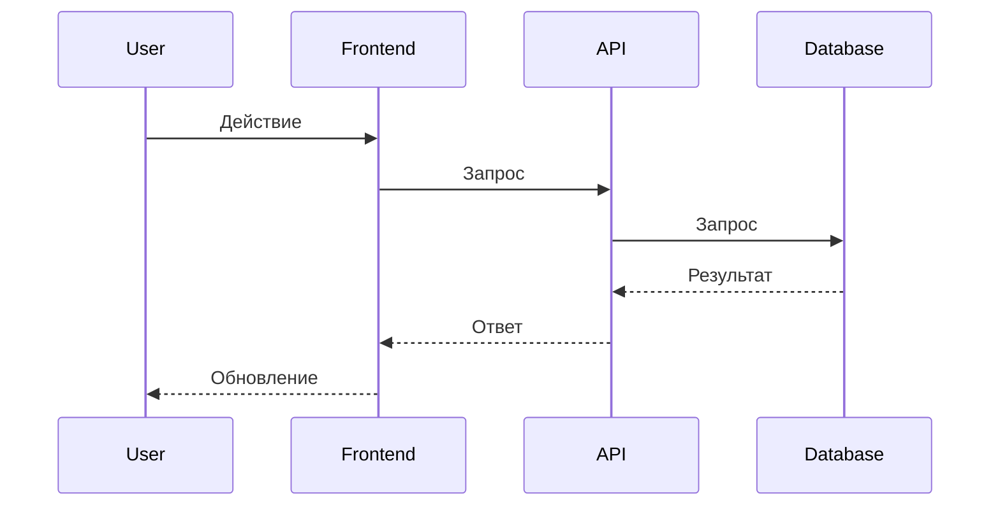

# Шаблон дизайна

**📍 Вы здесь:** [Главное руководство](../../README.md) → [Шаблоны](README.md) → **Шаблон дизайна**

## Быстрая навигация

- **📚 Изучить процесс:** [Руководство по фазе дизайна](../process/design-phase.md) - Как использовать этот шаблон
- **📖 Посмотреть пример:** [Дизайн сложной системы](../examples/complex-system-spec.md#design-document) - Шаблон в действии
- **🧠 Помощь в решениях:** [Фреймворки решений](../ai-reasoning/decision-frameworks.md) - Как принимать проектные решения
- **➡️ Следующий шаблон:** [Шаблон задач](tasks-template.md) - После завершения дизайна

---

Используйте этот шаблон для создания комплексных документов дизайна, которые переводят требования в технические спецификации.

## Информация о документе

- **Название функции**: [Название вашей функции]
- **Версия**: 1.0
- **Дата**: [Текущая дата]
- **Автор**: [Ваше имя]
- **Рецензенты**: [Список технических рецензентов]
- **Связанные документы**: [Ссылка на документ требований]

## Обзор

[Предоставьте высокоуровневое резюме подхода к дизайну. Объясните, как этот дизайн решает требования и вписывается в общую архитектуру системы. Держите этот раздел кратким, но комплексным.]

### Цели дизайна

- [Основная цель 1]
- [Основная цель 2]
- [Основная цель 3]

### Ключевые проектные решения

- [Решение 1 и обоснование]
- [Решение 2 и обоснование]
- [Решение 3 и обоснование]

## Архитектура

### Контекст системы

[Опишите, как эта функция вписывается в более широкую систему. Включите внешние зависимости и точки интеграции.]



### Высокоуровневая архитектура

[Опишите общий архитектурный подход и основные компоненты.]


### Технологический стек

| Слой | Технология | Обоснование |
|------|------------|-------------|
| Frontend | [Технология] | [Почему выбрана] |
| Backend | [Технология] | [Почему выбрана] |
| База данных | [Технология] | [Почему выбрана] |
| Инфраструктура | [Технология] | [Почему выбрана] |

## Компоненты и интерфейсы

### Компонент 1: [Название компонента]

**Назначение**: [Что делает этот компонент]

**Ответственности**:

- [Ответственность 1]
- [Ответственность 2]
- [Ответственность 3]

**Интерфейсы**:

- **Вход**: [Что получает]
- **Выход**: [Что производит]
- **Зависимости**: [От чего зависит]

**Заметки по реализации**:

- [Ключевая деталь реализации 1]
- [Ключевая деталь реализации 2]

### Компонент 2: [Название компонента]

**Назначение**: [Что делает этот компонент]

**Ответственности**:

- [Ответственность 1]
- [Ответственность 2]

**Интерфейсы**:

- **Вход**: [Что получает]
- **Выход**: [Что производит]
- **Зависимости**: [От чего зависит]

**Заметки по реализации**:

- [Ключевая деталь реализации 1]
- [Ключевая деталь реализации 2]

### Компонент 3: [Название компонента]

**Назначение**: [Что делает этот компонент]

**Ответственности**:

- [Ответственность 1]
- [Ответственность 2]

**Интерфейсы**:

- **Вход**: [Что получает]
- **Выход**: [Что производит]
- **Зависимости**: [От чего зависит]

**Заметки по реализации**:

- [Ключевая деталь реализации 1]
- [Ключевая деталь реализации 2]

## Модели данных

### Сущность 1: [Название сущности]

```typescript
interface EntityName {
  id: string;
  property1: string;
  property2: number;
  property3: boolean;
  createdAt: Date;
  updatedAt: Date;
}
```

**Правила валидации**:

- [Правило валидации 1]
- [Правило валидации 2]

**Связи**:

- [Связь с другими сущностями]

### Сущность 2: [Название сущности]

```typescript
interface EntityName {
  id: string;
  property1: string;
  property2: EntityName[];
  status: 'active' | 'inactive' | 'pending';
}
```

**Правила валидации**:

- [Правило валидации 1]
- [Правило валидации 2]

**Связи**:

- [Связь с другими сущностями]

### Поток данных



## Дизайн API

### Конечная точка 1: [Название конечной точки]

**Метод**: `POST`  
**Путь**: `/api/v1/[ресурс]`

**Запрос**:

```json
{
  "property1": "string",
  "property2": "number",
  "property3": "boolean"
}
```

**Ответ**:

```json
{
  "id": "string",
  "property1": "string",
  "property2": "number",
  "createdAt": "ISO date string"
}
```

**Ответы об ошибках**:

- `400 Bad Request`: [Когда это происходит]
- `401 Unauthorized`: [Когда это происходит]
- `404 Not Found`: [Когда это происходит]

### Конечная точка 2: [Название конечной точки]

**Метод**: `GET`  
**Путь**: `/api/v1/[ресурс]/{id}`

**Параметры**:

- `id` (путь): [Описание]
- `include` (запрос, необязательный): [Описание]

**Ответ**:

```json
{
  "id": "string",
  "property1": "string",
  "property2": "number"
}
```

## Соображения безопасности

### Аутентификация

- [Метод аутентификации и реализация]
- [Подход к управлению токенами]

### Авторизация

- [Модель авторизации и правила]
- [Стратегия проверки разрешений]

### Защита данных

- [Подход к шифрованию данных]
- [Процедуры обработки PII]
- [Политики хранения данных]

### Валидация входных данных

- [Стратегии валидации]
- [Процедуры санитизации]
- [Подход к ограничению скорости]

## Обработка ошибок

### Категории ошибок

| Категория | HTTP статус | Описание | Действие пользователя |
|-----------|-------------|----------|----------------------|
| Валидация | 400 | Неверные входные данные | Исправить входные данные и повторить |
| Аутентификация | 401 | Неверные учетные данные | Повторная аутентификация |
| Авторизация | 403 | Недостаточно разрешений | Обратиться к администратору |
| Не найдено | 404 | Ресурс не существует | Проверить идентификатор ресурса |
| Ошибка сервера | 500 | Внутренняя ошибка системы | Повторить позже или обратиться в поддержку |

### Формат ответа об ошибке

```json
{
  "error": {
    "code": "ERROR_CODE",
    "message": "Читаемое сообщение об ошибке",
    "details": {
      "field": "Конкретная ошибка поля"
    },
    "timestamp": "ISO date string",
    "requestId": "unique-request-id"
  }
}
```

### Стратегия логирования

- **Логи ошибок**: [Что логируется для ошибок]
- **Аудит логи**: [Что логируется для аудита]
- **Логи производительности**: [Что логируется для мониторинга]

## Соображения производительности

### Ожидаемая нагрузка

- **Одновременные пользователи**: [Число]
- **Запросов в секунду**: [Число]
- **Объем данных**: [Размер/Скорость роста]

### Требования к производительности

- **Время отклика**: [Целевые времена отклика]
- **Пропускная способность**: [Целевая пропускная способность]
- **Доступность**: [Требования к времени работы]

### Стратегии оптимизации

- [Стратегия кэширования]
- [Подход к оптимизации базы данных]
- [Использование CDN]
- [Подход к балансировке нагрузки]

### Мониторинг и метрики

- [Ключевые показатели эффективности]
- [Инструменты мониторинга и панели управления]
- [Пороги оповещений]

## Стратегия тестирования

### Модульное тестирование

- **Цель покрытия**: [Процент]
- **Фреймворк тестирования**: [Название фреймворка]
- **Ключевые области тестирования**: [Критическая функциональность для тестирования]

### Интеграционное тестирование

- **Тестирование API**: [Подход и инструменты]
- **Тестирование базы данных**: [Подход и инструменты]
- **Тестирование внешних сервисов**: [Стратегия мокирования]

### Сквозное тестирование

- **Пользовательские сценарии**: [Ключевые пользовательские пути для тестирования]
- **Инструменты тестирования**: [Фреймворк E2E тестирования]
- **Тестовая среда**: [Настройка среды]

### Тестирование производительности

- **Нагрузочное тестирование**: [Подход и инструменты]
- **Стресс-тестирование**: [Лимиты для тестирования]
- **Мониторинг**: [Метрики производительности для отслеживания]

## Развертывание и операции

### Стратегия развертывания

- [Подход к развертыванию (blue-green, rolling и т.д.)]
- [Прогрессия среды]
- [Процедуры отката]

### Управление конфигурацией

- [Подход к конфигурации]
- [Настройки для конкретной среды]
- [Управление секретами]

### Мониторинг и оповещения

- [Проверки здоровья]
- [Ключевые метрики для мониторинга]
- [Условия оповещений и эскалация]

### Процедуры обслуживания

- [Регулярные задачи обслуживания]
- [Процедуры резервного копирования и восстановления]
- [Стратегия обновлений и патчей]

## Миграция и совместимость

### Миграция данных

- [Стратегия миграции, если применимо]
- [Требования к преобразованию данных]
- [Процедуры отката]

### Обратная совместимость

- [Стратегия версионирования API]
- [Процедуры критических изменений]
- [Временная шкала устаревания]

### Влияние на интеграцию

- [Влияние на существующие системы]
- [Необходимые изменения в зависимых системах]
- [План коммуникации для изменений]

---

## Чек-лист обзора дизайна

Используйте этот чек-лист для валидации вашего документа дизайна:

### Архитектура

- [ ] Высокоуровневая архитектура четко описана
- [ ] Ответственности компонентов четко определены
- [ ] Интерфейсы между компонентами специфицированы
- [ ] Выбор технологий обоснован

### Соответствие требованиям

- [ ] Дизайн решает все функциональные требования
- [ ] Нефункциональные требования рассмотрены
- [ ] Критерии успеха могут быть достигнуты с этим дизайном
- [ ] Ограничения и предположения рассмотрены

### Техническое качество

- [ ] Дизайн следует установленным паттернам и принципам
- [ ] Соображения безопасности рассмотрены
- [ ] Требования производительности рассмотрены
- [ ] Обработка ошибок комплексная

### Готовность к реализации

- [ ] Дизайн предоставляет достаточно деталей для реализации
- [ ] Модели данных полные и валидированные
- [ ] Спецификации API детальные
- [ ] Стратегия тестирования комплексная

### Поддерживаемость

- [ ] Дизайн поддерживает будущую расширяемость
- [ ] Компоненты слабо связаны
- [ ] Конфигурация вынесена наружу
- [ ] Мониторинг и наблюдаемость включены

---

## Справочник паттернов дизайна

### Общие паттерны для рассмотрения

**Порождающие паттерны**:

- Фабрика: Когда нужно создавать объекты без указания точных классов
- Строитель: При пошаговом построении сложных объектов
- Одиночка: Когда нужен ровно один экземпляр класса

**Структурные паттерны**:

- Адаптер: При интеграции несовместимых интерфейсов
- Декоратор: При добавлении поведения без изменения структуры
- Фасад: При упрощении сложных интерфейсов подсистем

**Поведенческие паттерны**:

- Наблюдатель: Когда объекты должны быть уведомлены об изменениях состояния
- Стратегия: При необходимости переключения между алгоритмами
- Команда: При необходимости параметризации объектов операциями

**Архитектурные паттерны**:

- MVC/MVP/MVVM: Для разделения представления и бизнес-логики
- Репозиторий: Для абстракции логики доступа к данным
- Единица работы: Для поддержания согласованности между несколькими операциями

---

[← Шаблон требований](requirements-template.md) | [Шаблон задач →](tasks-template.md)
