# Диаграммы рабочих процессов и визуальные пособия

Этот документ предоставляет визуальные представления процесса разработки на основе спецификаций, включая полные диаграммы рабочих процессов, деревья решений и потоки переходов между фазами.

## Полный поток процесса

Следующая диаграмма показывает полный рабочий процесс разработки на основе спецификаций от первоначальной идеи до реализации:

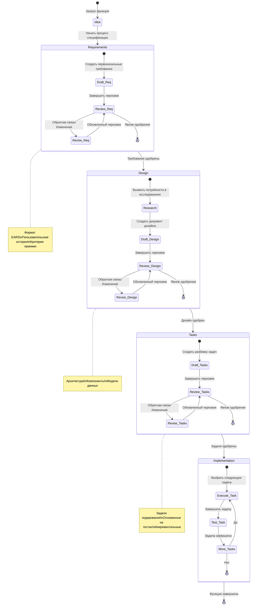

## Дерево решений переходов между фазами

Это дерево решений помогает определить, когда переходить между фазами и когда итерировать:

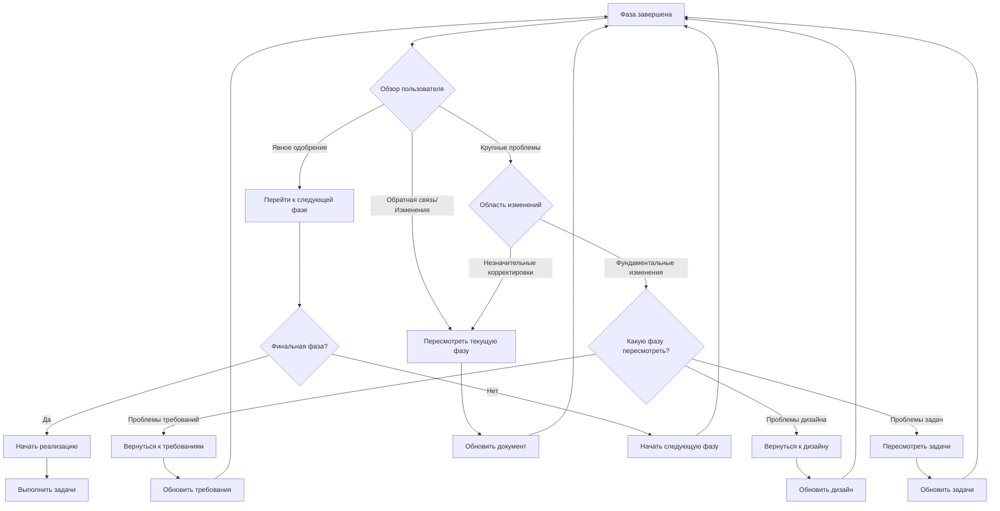

## Поток фазы требований

Детальный рабочий процесс для фазы сбора требований:

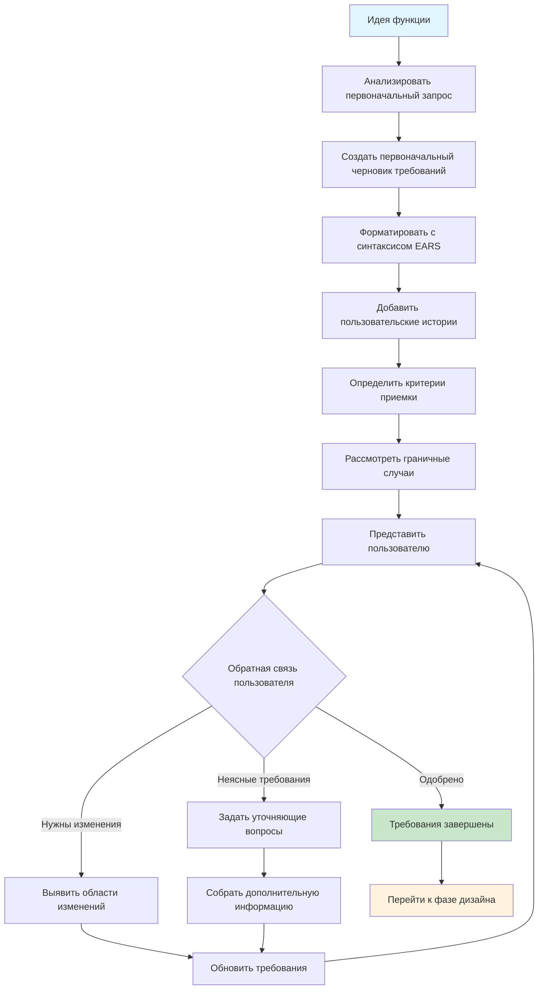

## Поток фазы дизайна

Детальный рабочий процесс для фазы дизайна:

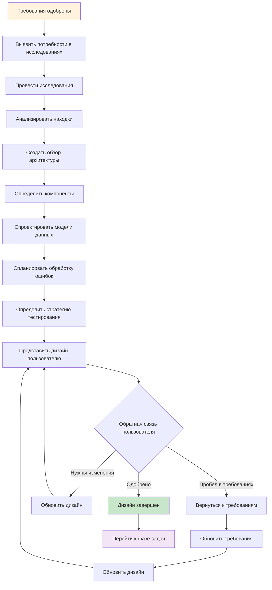

## Поток фазы задач

Детальный рабочий процесс для разбивки дизайна на задачи реализации:

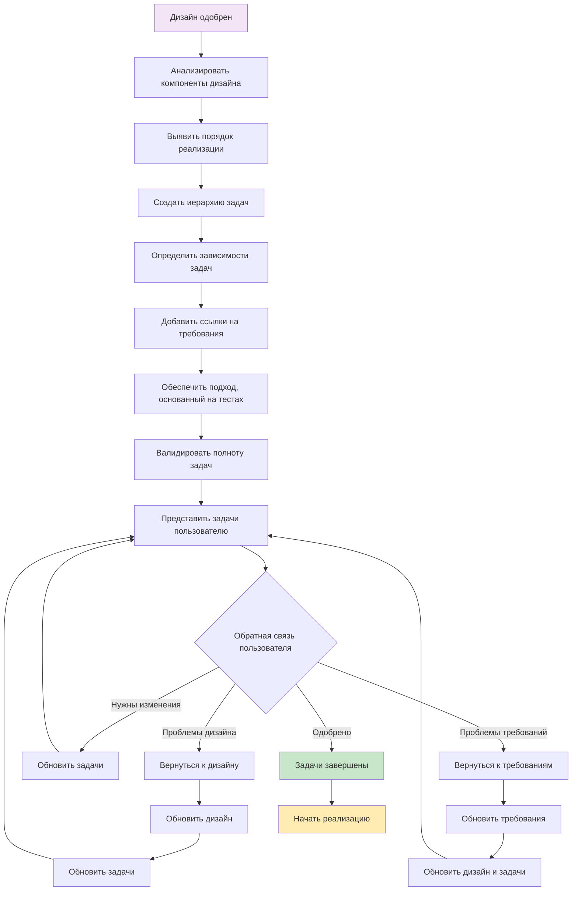

## Поток выполнения реализации

Рабочий процесс для выполнения отдельных задач из плана реализации:

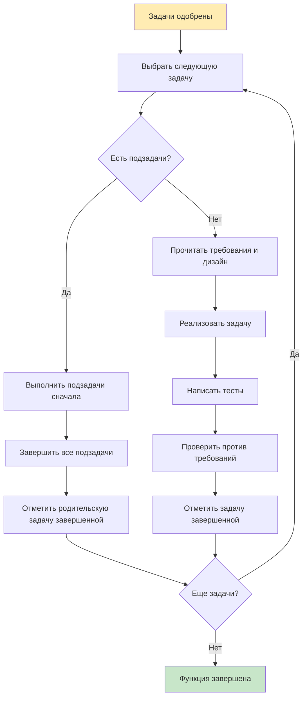

## Паттерны обратной связи

Распространенные паттерны для обработки обратной связи и итераций:

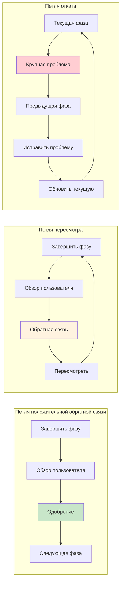

## Точки входа и контекст

Разные способы, которыми пользователи могут войти в рабочий процесс спецификации:

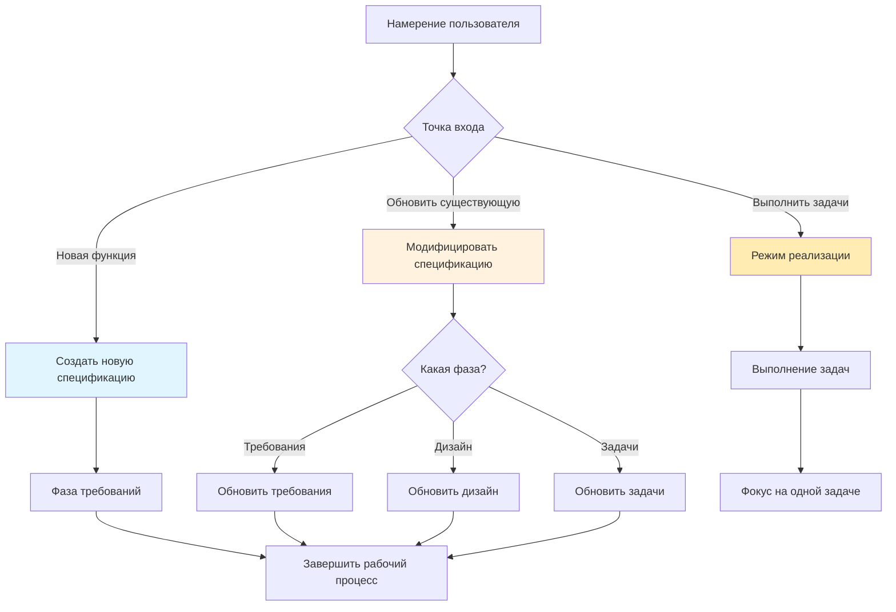

## Контрольные точки качества и валидации

Ключевые контрольные точки валидации на протяжении процесса:

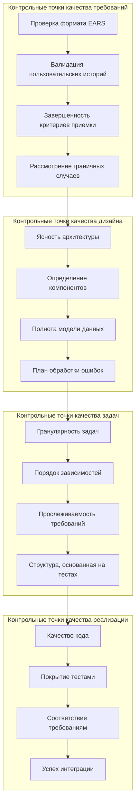

## Распространенные сценарии рабочих процессов

### Сценарий 1: Плавное линейное прогрессирование
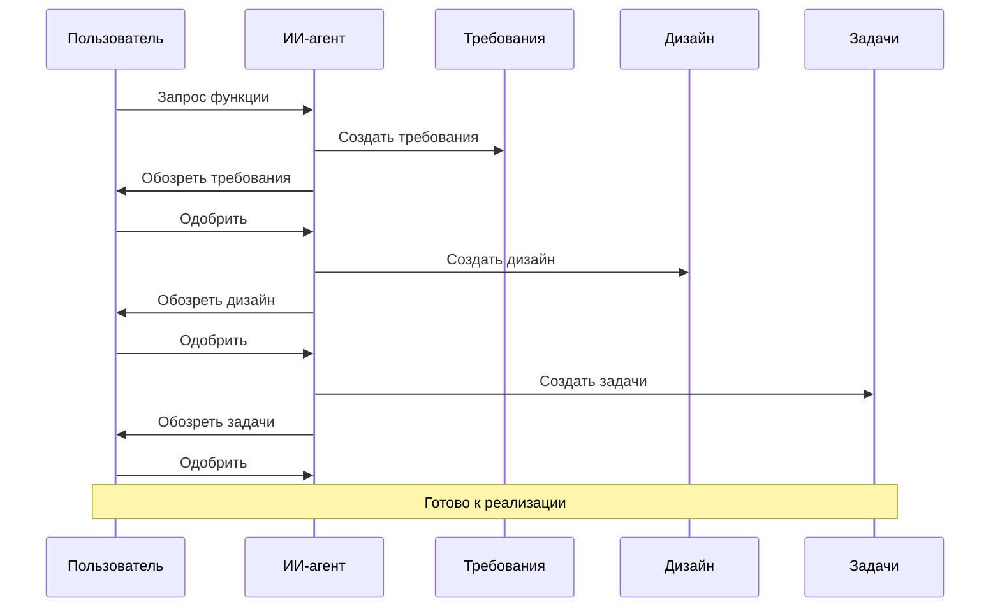

### Сценарий 2: Итеративное уточнение
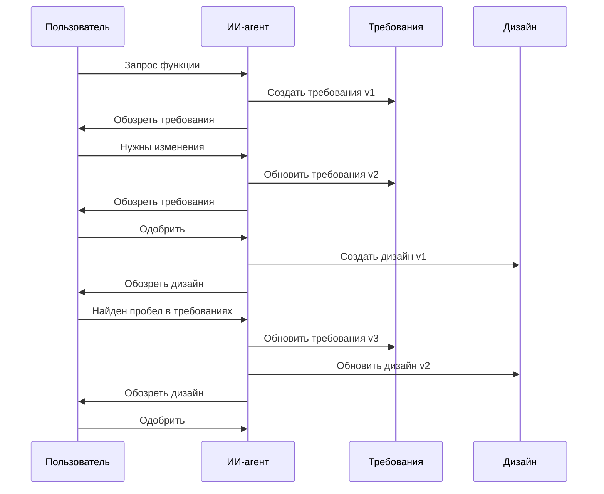

### Сценарий 3: Обратная связь реализации
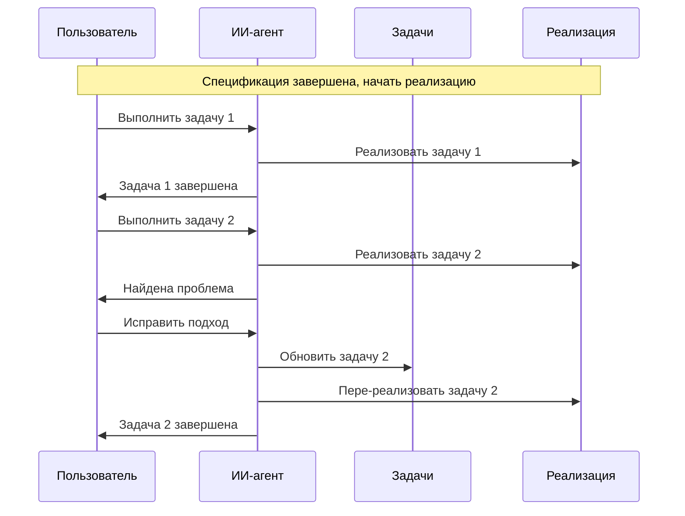

Эти визуальные пособия предоставляют комплексное руководство для понимания и навигации процесса разработки на основе спецификаций, поддерживая как новичков, изучающих методологию, так и опытных практиков, ищущих справочные материалы.