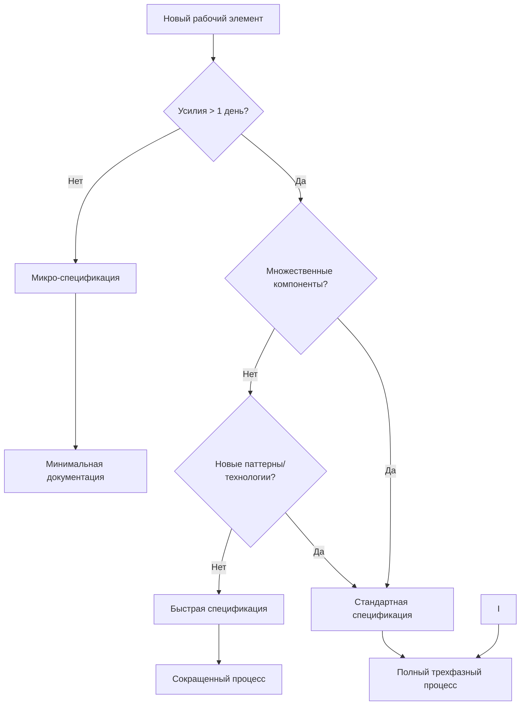

# Методология «Разработка на основе спецификаций»

Разработка на основе спецификаций — это систематический подход к разработке программных функций, который подчеркивает тщательное планирование, четкую документацию и структурированную реализацию. Эта методология преобразует грубые идеи функций в четко определенные, реализуемые решения через трехфазный процесс, который обеспечивает качество, поддерживаемость и успешную доставку.

## Основная философия

### Ясность перед кодом

Фундаментальный принцип разработки на основе спецификаций заключается в том, что **ясность мысли и цели должна предшествовать реализации**. Этот подход требует инвестиций времени в тщательное понимание требований, проектирование решений и планирование реализации до написания первой строки кода.

Когда команда тратит время на предварительное планирование:

- **Снижается неопределенность** - разработчики четко понимают, что именно нужно создать и почему
- **Минимизируется переработка** - меньше вероятность обнаружения критических проблем на поздних стадиях
- **Повышается точность реализации** - увеличивается вероятность создания именно того решения, которое необходимо бизнесу

Этот принцип особенно важен в современных условиях, когда требования к программному обеспечению становятся все более сложными, а сроки реализации сжатыми. Инвестиции в начальное планирование окупаются многократно на этапе реализации и последующего сопровождения.

### Итеративное уточнение

Каждая фаза процесса спецификации предназначена для итеративного уточнения, а не для однократного прохождения. В отличие от линейного перехода от идеи к реализации, методология поощряет постоянное возвращение к предыдущим этапам для корректировки и уточнения.

Этот подход имеет несколько ключевых преимуществ:

- **Раннее выявление проблем** - технические сложности, несоответствия требований или непредвиденные зависимости обнаруживаются на этапе проектирования, когда их дешевле исправить
- **Постепенное наращивание уверенности** - каждая итерация укрепляет понимание задачи и увеличивает уверенность в правильности выбранного направления
- **Гибкость в условиях неопределенности** - позволяет корректировать курс по мере получения новых данных, не теряя при этом структурированного подхода

Итеративность проявляется на всех уровнях процесса - от уточнения требований через исследование технических вариантов до детализации плана реализации. Это создает прочный фундамент для последующей работы.

### Документация как коммуникация

Спецификации в этой методологии служат не просто формальными документами планирования, а являются **ключевыми инструментами коммуникации**, которые выполняют несколько критически важных функций:

- **Согласование заинтересованных сторон** - документированные требования и дизайн становятся общим языком для разработчиков, менеджеров, заказчиков и других участников проекта
- **Сохранение обоснования решений** - фиксируется не только "что" было решено, но и "почему", что критически важно при последующих изменениях
- **Предоставление контекста для будущего обслуживания** - новые члены команды могут быстро понять систему через документированные решения
- **Создание долгосрочного актива** - хорошо написанные спецификации сохраняют ценность даже после завершения первоначальной реализации

Эта философия рассматривает документацию не как необходимое зло, а как инвестицию в будущее проекта, которая окупается через улучшенное понимание, снижение рисков и упрощение сопровождения.

---

## Преимущества разработки на основе спецификаций

### Снижение рисков и неопределенности

Благодаря тщательному планированию перед реализацией, разработка на основе спецификаций значительно снижает риск построения неправильной функциональности или столкновения с неожиданными техническими проблемами. Систематический подход помогает выявлять и решать проблемы на раннем этапе процесса, когда их исправление требует минимальных затрат.

Конкретные проявления этого преимущества:

- Предотвращение "строительства не того", что заказывали
- Раннее выявление противоречивых или нереалистичных требований
- Обнаружение технических ограничений до начала кодирования
- Устранение недопонимания между заинтересованными сторонами на ранней стадии

### Улучшенное качество и поддерживаемость

Функции, разработанные через процесс спецификации, как правило, демонстрируют более высокое качество и легче поддаются сопровождению. Это связано с несколькими факторами:

- **Четкие требования** создают основу для более полного тестирования и валидации
- **Продуманный дизайн** приводит к лучшей архитектуре и разделению ответственностей
- **Предварительное планирование обработки ошибок** снижает количество багов в production
- **Документированное обоснование решений** облегчает будущие изменения и модификации

Эти аспекты в совокупности приводят к созданию более надежного, тестируемого и модифицируемого кода, что особенно важно для долгосрочных проектов.

### Улучшенное сотрудничество

Спецификации предоставляют общий язык и общее понимание между различными участниками проекта:

- **Разработчики** получают четкое представление о том, что нужно реализовать
- **Тестировщики** могут подготовить тест-кейсы параллельно с разработкой
- **Менеджеры проектов** видят полную картину требований и сложности
- **Заказчики** могут подтвердить, что их потребности правильно поняты

Эта улучшенная коммуникация снижает недопонимание, уменьшает количество переделок и обеспечивает более эффективное взаимодействие всех участников проекта на всех этапах.

### Лучшая оценка и планирование

Детальное планирование, присущее разработке на основе спецификаций, обеспечивает более точную оценку временных и ресурсных затрат. Когда команда тратит время на анализ требований и проектирование до начала реализации, менеджеры проектов и разработчики могут принимать более обоснованные решения:

- **Более точные оценки трудозатрат** - понимание полной сложности позволяет давать реалистичные сроки
- **Эффективное распределение ресурсов** - знание зависимостей помогает оптимально назначать задачи
- **Прозрачное управление ожиданиями** - заказчики получают четкое представление о том, что будет доставлено и когда
- **Гибкое управление объемом работ** - возможность приоритизации на основе четко определенных требований

Это особенно ценно в условиях ограниченных ресурсов и сжатых сроков, когда каждая минута планирования экономит часы реализации.

### Сохранение знаний

Одним из наиболее недооцененных преимуществ является способность спецификаций служить **живой документацией**, которая сохраняет критически важные знания о проекте:

- **Обоснование дизайна** - почему были выбраны определенные архитектурные решения
- **Контекст требований** - как бизнес-потребности превратились в технические решения
- **История изменений** - как и почему требования эволюционировали со временем
- **Предупреждения и ловушки** - известные проблемы и рекомендации по их избежанию

Эти знания остаются доступными долго после того, как первоначальные разработчики перешли к другим проектам, что существенно снижает "знаниевый долг" и упрощает передачу проекта новым участникам.

---

## Сравнение с другими методологиями разработки

### Традиционная каскадная разработка

**Сходства**:

- Оба подхода подчеркивают важность предварительного планирования и документации
- Оба следуют последовательному фазовому подходу к разработке

**Ключевые различия**:

- **Итеративность в рамках фаз**: Разработка на основе спецификаций поощряет уточнение и валидацию на каждом этапе, тогда как каскадная модель предполагает строго последовательное движение без возвратов
- **Живые документы**: Спецификации предназначены для эволюции как рабочие документы, тогда как в каскадной модели документы часто фиксируются после утверждения
- **Масштаб применения**: Методология оптимизирована для разработки на уровне отдельных функций, а не целых проектов, что делает ее более гибкой
- **Интеграция с современными практиками**: Разработка на основе спецификаций учитывает особенности работы с ИИ-инструментами и современными agile-практиками

### Гибкая разработка (Agile)

**Сходства**:

- Оба подхода ценят работающее программное обеспечение и сотрудничество с клиентами
- Оба принимают итеративное уточнение и обратную связь как неотъемлемую часть процесса

**Ключевые различия**:

- **Глубина предварительного дизайна**: Разработка на основе спецификаций делает больший акцент на тщательном проектировании перед реализацией, тогда как классический Agile часто откладывает дизайн до момента реализации
- **Структура документации**: Методология предусматривает более структурированные требования к документированию, тогда как Agile традиционно фокусируется на "работающем ПО вместо всеобъемлющей документации"
- **Совместимость**: Разработка на основе спецификаций предназначена для работы в рамках гибких фреймворков, а не для их замены, что делает ее дополнением к Agile, а не альтернативой
- **Масштаб применения**: Может применяться к отдельным функциям в рамках гибких спринтов, обеспечивая структуру там, где это необходимо

### Разработка через тестирование (TDD)

**Сходства**:

- Оба подхода подчеркивают важность определения критериев успеха перед реализацией
- Оба используют итеративный цикл (красный-зеленый-рефакторинг в TDD соответствует циклу требования-дизайн-реализация в разработке на основе спецификаций)

**Ключевые различия**:

- **Уровень абстракции**: Разработка на основе спецификаций работает на более высоком уровне, охватывая не только отдельные модули, но и системные взаимодействия
- **Ширина охвата**: Включает бизнес-требования и системный дизайн, а не только тестовые случаи
- **Интеграция практик**: Может включать практики TDD в рамках своей фазы реализации как один из инструментов
- **Контекст**: Предоставляет более широкий контекст, включающий не только технические аспекты, но и бизнес-цели и пользовательские потребности

### Разработка с приоритетом дизайна (Design-First)

**Сходства**:

- Оба подхода приоритизируют дизайн и планирование перед непосредственным кодированием
- Оба создают детальные технические спецификации перед реализацией

**Ключевые различия**:

- **Сбор требований**: Разработка на основе спецификаций включает явную, структурированную фазу сбора требований с использованием методик вроде EARS, тогда как Design-First часто предполагает, что требования уже определены
- **Планирование задач**: Предоставляет более структурированный подход к разбиению задач и планированию реализации
- **AI-оптимизация**: Специально разработана с учетом особенностей рабочих процессов разработки с помощью ИИ
- **Стандартизация требований**: Включает специфические методологии, такие как EARS (Easy Approach to Requirements Syntax) для создания четких, тестируемых требований

---

## Трехфазный подход

### Фаза 1: Сбор требований

**Цель**: Преобразовать расплывчатые идеи функций в четкие, тестируемые требования, которые могут быть однозначно поняты всеми заинтересованными сторонами.

**Ключевые виды деятельности**:

- **Захват пользовательских историй**, которые выражают не только "что" нужно сделать, но и "почему", фокусируясь на ценности для пользователя или бизнеса
- **Определение критериев приемки** с использованием методики EARS (Easy Approach to Requirements Syntax), которая помогает создавать четкие, недвусмысленные и тестируемые требования
- **Выявление граничных случаев и ограничений**, включая нефункциональные требования, такие как производительность, безопасность и масштабируемость
- **Валидация полноты и осуществимости** через проверку на противоречия, пробелы и техническую реалистичность

**Преимущества**:

- Обеспечивает общее понимание всеми заинтересованными сторонами того, что именно будет построено
- Предоставляет четкие критерии успеха для последующих этапов реализации и тестирования
- Снижает риск "расползания области" и дрейфа функциональности во время разработки
- Создает основу для разработки тестов и валидации результатов еще до начала написания кода

### Фаза 2: Документация дизайна

**Цель**: Создать комплексный технический план реализации, который определяет архитектурные решения, структуру системы и ключевые взаимодействия.

**Ключевые виды деятельности**:

- **Исследование технических подходов и ограничений**, включая анализ возможных вариантов решения и их сравнение по критериям
- **Определение архитектуры системы и взаимодействий компонентов**, с акцентом на интерфейсы и границы ответственности
- **Спецификация моделей данных и интерфейсов**, включая формальные определения API, схем данных и протоколов обмена
- **Планирование стратегий обработки ошибок, тестирования и мониторинга**, чтобы обеспечить надежность и поддерживаемость системы

**Преимущества**:

- Выявляет потенциальные технические проблемы и сложности до начала кодирования, когда их исправление обходится дешевле
- Обеспечивает более точную оценку трудозатрат и ресурсов благодаря глубокому пониманию задачи
- Предоставляет четкую дорожную карту для реализации, уменьшая когнитивную нагрузку на разработчиков
- Документирует принятые решения дизайна и их обоснование, что критически важно для будущего сопровождения

### Фаза 3: Планирование задач

**Цель**: Разбить дизайн на выполнимые, последовательные шаги реализации, которые могут быть распределены между разработчиками и отслеживаться на протяжении всего цикла.

**Ключевые виды деятельности**:

- **Преобразование элементов дизайна в конкретные задачи кодирования** с четкими входными и выходными данными
- **Последовательность задач** для обеспечения инкрементального прогресса и возможности ранней валидации
- **Определение четких целей и критериев завершения** для каждой задачи, чтобы обеспечить объективную оценку прогресса
- **Ссылка на исходные требования** для обеспечения прослеживаемости и подтверждения, что все аспекты функциональности охвачены

**Преимущества**:

- Делает большие функции управляемыми через декомпозицию на логические, независимые части
- Обеспечивает возможность параллельной работы нескольких разработчиков с минимальными конфликтами
- Упрощает отслеживание прогресса и выявление узких мест на ранних стадиях реализации
- Снижает когнитивную нагрузку на разработчиков, позволяя сосредоточиться на одной задаче за раз
- Облегчает обзор кода и обеспечение качества благодаря четкому разделению ответственностей

---

## Облегченные спецификации

### Принципы облегченных спецификаций

Облегченные спецификации представляют собой адаптированный подход к методологии, который сохраняет ее ключевые преимущества при работе с небольшими функциями, исправлениями ошибок и быстрыми итерациями. Основная цель — обеспечить достаточный уровень планирования без избыточной бюрократии, сохраняя баланс между тщательной подготовкой и оперативной реализацией.

Ключевые принципы:

- **Пропорциональность усилий** - объем документации соответствует сложности задачи
- **Минимализм** - документация ограничена только тем, что необходимо для понимания и проверки
- **Гибкость** - возможность расширения спецификации при обнаружении неожиданной сложности
- **Практичность** - фокус на том, что реально поможет в реализации, а не на формальных требованиях

### Дерево решений сложности спецификации

### Типы облегченных спецификаций

#### Микро-спецификация

**Применяется для**: Исправлений ошибок, изменений текста, обновлений конфигурации, незначительных изменений UI (менее 1 дня усилий).

**Особенности**:

- **Минимальная документация** с акцентом на суть изменений, часто в виде комментариев в системе отслеживания задач
- **Краткое обоснование** и четкие критерии приемки, достаточные для проверки правильности
- **Отсутствие формального дизайна** и детального планирования задач - решение принимается непосредственно в процессе реализации
- **Документация ограничена** необходимым минимумом для понимания и проверки, часто включает только "что" и "почему", без детального "как"

**Пример**: Исправить опечатку в тексте приветствия

#### Быстрая спецификация

**Применяется для**: Небольших функций, добавлений API endpoints, изменений схемы базы данных, модификаций компонентов (1-3 дня усилий).

**Особенности**:

- **Упрощенный сбор требований** с фокусом на ключевые пользовательские истории и критерии приемки
- **Прямое преобразование требований в задачи реализации** без отдельной формальной фазы дизайна - дизайн интегрирован в процесс планирования задач
- **Четкие критерии приемки** и определение "готовности" для каждой задачи
- **Сохранение прослеживаемости** между требованиями и задачами через явные ссылки

**Пример**: Как пользователь, я хочу видеть время последнего входа в систему

### Динамическая адаптация уровня спецификации

#### Признаки необходимости повышения уровня спецификации

**Для микро-спецификаций**:

- Реализация занимает значительно больше времени, чем первоначально оценено
- Обнаруживаются неочевидные зависимости между компонентами
- Возникают сложные граничные случаи, не учтенные в первоначальных критериях
- Требуется согласование с другими командами или системами

**Для быстрых спецификаций**:

- Возникают сложные вопросы дизайна во время реализации, требующие серьезного анализа
- Обнаруживаются скрытые зависимости от других систем или компонентов
- Выявляются значительные последствия для производительности, безопасности или масштабируемости
- Требуется дополнительное согласование с заинтересованными сторонами из-за расширения области

#### Процесс адаптации

1. **Оценка текущего состояния**: Анализ причин увеличения сложности и определение конкретных областей, требующих дополнительной проработки

2. **Определение недостающих элементов**: Какие аспекты требуют дополнительной спецификации - требования, дизайн или детализация задач

3. **Доработка спецификации**: Добавление необходимых элементов с фокусом на решении выявленных проблем, без полного переписывания существующей документации

4. **Согласование изменений**: Обсуждение с заинтересованными сторонами расширенной спецификации и получение подтверждения

5. **Продолжение реализации**: Переход к кодированию с улучшенной основой, используя дополненную спецификацию как руководство

Этот гибкий подход обеспечивает баланс между необходимой структурой и оперативностью, позволяя масштабировать усилия по спецификации в соответствии с реальными потребностями проекта, сохраняя при этом основные принципы и преимущества разработки на основе спецификаций.

---

## Направляющие документы

**Направляющие документы** - это руководящие принципы работы с проектом.

Они содержат стандарты, соглашения, специфичные для проекта, которые помогают команде работать более согласовано. Эти документы призваны "направить" разработчика при работе с проектом и решают 2 проблемы:

- Документация информации, не относящейся к конкретной спецификации. Например gitflow решения.
- Документация информации, повторяющейся между спецификациями. Например глобальная стратегия тестирования решения, технологический стек решения или кодстайл решения.

**Основные принципы**:

- Перечень направляющих документов индивидуален для каждого стека, команды и решения.
- Перечень направляющих документов может изменяться в процессе развития решения.
- Разные направляющие актуальны на разных этапах работы со спецификацей.
- Направляющие документы являются общим контекстом проекта.
- Рекомендуется создавать в спецификации отдельные задачи на поддержание актуальности направляющих документов.
- Рекомендуется ссылаться в дизайне спецификации на конкретные направляющие документы.
- Рекомендуется создавать множество атомарных направляющих документов, вместо нескольких крупных.
- Вы можете иметь направляющие, как относящиейся ко всему решению, так и относящиеся к конкретному компоненту или модулю решения.

## Заключение

Разработка на основе спецификаций представляет собой сбалансированный подход, который сочетает преимущества тщательного планирования с гибкостью, необходимой для современной разработки программного обеспечения. Эта методология не требует жесткого следования формальным процессам, но предоставляет структуру, которая может быть адаптирована к конкретным потребностям проекта.

Следуя трехфазной методологии и применяя облегченные спецификации там, где это уместно, команды разработки могут достичь оптимального баланса между подготовкой и реализацией. Это позволяет:

- Создавать более качественное программное обеспечение с меньшим количеством ошибок
- Снижать риски проектов за счет раннего выявления проблем
- Улучшать коммуникацию между всеми участниками процесса
- Сохранять знания о проекте для долгосрочного сопровождения

Методология особенно эффективна в сочетании с современными инструментами разработки с помощью ИИ, поскольку структурированный подход к требованиям, дизайну и планированию задач обеспечивает четкий контекст, который необходим системам искусственного интеллекта для максимальной эффективности. ИИ-ассистенты могут лучше понять задачу и предложить более точные решения, когда требования и дизайн четко определены.

Адаптивная природа облегченных спецификаций делает методологию универсальной - она может быть применена в различных контекстах, от небольших исправлений ошибок до крупных проектов, обеспечивая оптимальный баланс между подготовкой и реализацией. Это делает разработку на основе спецификаций мощным инструментом в арсенале современных разработчиков, помогающим создавать лучшее программное обеспечение более эффективно и с меньшими рисками.
