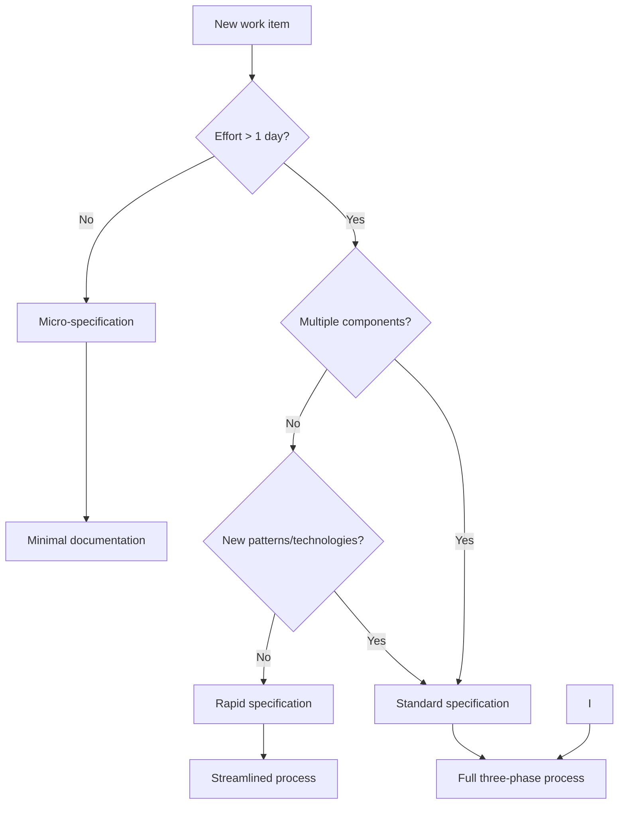

# 🚀 Specification-Driven Development Methodology

Specification-driven development is a systematic approach to developing software features that emphasizes thorough planning, clear documentation, and structured implementation. This methodology transforms vague feature ideas into clearly defined, implementable solutions through a three-phase process that ensures quality, maintainability, and successful delivery.

## Core Philosophy

### Clarity Before Code

The fundamental principle of specification-driven development is that **clarity of thought and purpose must precede implementation**. This approach requires investing time upfront to thoroughly understand requirements, design solutions, and plan implementation before writing a single line of code.

When a team dedicates time to upfront planning:

- **Uncertainty is reduced** – developers clearly understand exactly what needs to be built and why  
- **Rework is minimized** – the likelihood of discovering critical issues late in the process decreases significantly  
- **Implementation accuracy improves** – the probability of delivering precisely the solution the business needs increases  

This principle is especially critical in today’s environment, where software requirements grow increasingly complex while delivery timelines become tighter. The investment in initial planning pays dividends many times over during implementation and subsequent maintenance phases.

### Iterative Refinement

Each phase of the specification process is designed for iterative refinement rather than a one-time pass. Unlike a linear progression from idea to implementation, the methodology encourages continuous revisiting of earlier stages to adjust and clarify.

This approach offers several key advantages:

- **Early problem detection** – technical complexities, requirement mismatches, or unforeseen dependencies are identified during the design phase when they are cheapest to fix  
- **Gradual confidence building** – each iteration deepens understanding of the problem and increases confidence in the chosen direction  
- **Flexibility amid uncertainty** – allows course correction as new information emerges without sacrificing a structured approach  

Iterativity manifests at all process levels—from refining requirements through exploring technical alternatives to detailing the implementation plan. This creates a solid foundation for subsequent work.

### Documentation as Communication

In this methodology, specifications serve not merely as formal planning documents but as **key communication instruments** that fulfill several critically important functions:

- **Stakeholder alignment** – documented requirements and designs become a common language for developers, managers, customers, and other project participants  
- **Decision rationale preservation** – captures not only *what* was decided but *why*, which is crucial when making future changes  
- **Context provision for future maintenance** – new team members can quickly understand the system through documented decisions  
- **Creation of long-term assets** – well-written specifications retain value even after the initial implementation is complete  

This philosophy treats documentation not as a necessary evil but as an investment in the project’s future, yielding returns through improved understanding, reduced risk, and simplified maintenance.

---

## Benefits of Specification-Driven Development

### Reduced Risk and Uncertainty

Through thorough planning before implementation, specification-driven development significantly reduces the risk of building incorrect functionality or encountering unexpected technical issues. The systematic approach helps identify and resolve problems early in the process when fixes require minimal effort.

Concrete manifestations of this benefit include:

- Preventing the delivery of features that don’t match what was requested  
- Early identification of contradictory or unrealistic requirements  
- Discovery of technical constraints before coding begins  
- Elimination of stakeholder misunderstandings at an early stage  

### Improved Quality and Maintainability

Features developed through the specification process typically demonstrate higher quality and are easier to maintain. This stems from several factors:

- **Clear requirements** establish a foundation for more comprehensive testing and validation  
- **Thoughtful design** leads to better architecture and separation of responsibilities  
- **Proactive error-handling planning** reduces the number of bugs in production  
- **Documented decision rationale** facilitates future modifications and enhancements  

Collectively, these aspects result in more reliable, testable, and modifiable code—particularly valuable for long-term projects.

### Enhanced Collaboration

Specifications provide a common language and shared understanding among all project participants:

- **Developers** gain a clear picture of what needs to be implemented  
- **Testers** can prepare test cases in parallel with development  
- **Project managers** see the complete picture of requirements and complexity  
- **Customers** can confirm their needs have been correctly understood  

This improved communication reduces misunderstandings, minimizes rework, and enables more effective collaboration among all stakeholders throughout the project lifecycle.

### Better Estimation and Planning

The detailed planning inherent in specification-driven development enables more accurate estimation of time and resource requirements. When teams invest time in analyzing requirements and designing before implementation begins, project managers and developers can make better-informed decisions:

- **More accurate effort estimates** – understanding full complexity enables realistic timelines  
- **Efficient resource allocation** – knowledge of dependencies helps optimally assign tasks  
- **Transparent expectation management** – customers gain a clear understanding of what will be delivered and when  
- **Flexible scope management** – enables prioritization based on clearly defined requirements  

This is especially valuable under resource constraints and tight deadlines, where every minute of planning saves hours of implementation.

### Knowledge Preservation

One of the most undervalued benefits is the ability of specifications to serve as **living documentation** that preserves critically important project knowledge:

- **Design rationale** – why specific architectural decisions were made  
- **Requirement context** – how business needs translated into technical solutions  
- **Change history** – how and why requirements evolved over time  
- **Warnings and pitfalls** – known issues and recommendations for avoiding them  

This knowledge remains accessible long after the original developers have moved on to other projects, significantly reducing "knowledge debt" and simplifying project handover to new team members.

---

## Comparison with Other Development Methodologies

### Traditional Waterfall Development

**Similarities**:

- Both approaches emphasize the importance of upfront planning and documentation  
- Both follow a sequential, phase-based development approach  

**Key Differences**:

- **Iterativity within phases**: Specification-driven development encourages refinement and validation at each stage, whereas the waterfall model assumes strictly sequential progression without returns  
- **Living documents**: Specifications are designed to evolve as working documents, while waterfall documentation is often frozen after approval  
- **Scale of application**: The methodology is optimized for feature-level development rather than entire projects, making it more flexible  
- **Integration with modern practices**: Specification-driven development accounts for working with AI tools and contemporary agile practices  

### Agile Development

**Similarities**:

- Both approaches value working software and customer collaboration  
- Both embrace iterative refinement and feedback as integral parts of the process  

**Key Differences**:

- **Depth of upfront design**: Specification-driven development places greater emphasis on thorough design before implementation, whereas classic Agile often defers design until implementation time  
- **Documentation structure**: The methodology prescribes more structured documentation requirements, while Agile traditionally focuses on "working software over comprehensive documentation"  
- **Compatibility**: Specification-driven development is designed to work within agile frameworks rather than replace them, making it complementary to Agile rather than an alternative  
- **Scale of application**: Can be applied to individual features within agile sprints, providing structure where needed  

### Test-Driven Development (TDD)

**Similarities**:

- Both approaches emphasize defining success criteria before implementation  
- Both use iterative cycles (red-green-refactor in TDD corresponds to requirements-design-implementation in specification-driven development)  

**Key Differences**:

- **Level of abstraction**: Specification-driven development operates at a higher level, covering not just individual modules but also system interactions  
- **Scope of coverage**: Includes business requirements and system design, not just test cases  
- **Practice integration**: Can incorporate TDD practices within its implementation phase as one of many tools  
- **Context**: Provides broader context encompassing not only technical aspects but also business goals and user needs  

### Design-First Development

**Similarities**:

- Both approaches prioritize design and planning before actual coding  
- Both create detailed technical specifications before implementation  

**Key Differences**:

- **Requirements gathering**: Specification-driven development includes an explicit, structured requirements-gathering phase using techniques like EARS, whereas Design-First often assumes requirements are already defined  
- **Task planning**: Provides a more structured approach to task decomposition and implementation planning  
- **AI optimization**: Specifically designed with AI-assisted development workflows in mind  
- **Requirements standardization**: Incorporates specific methodologies like EARS (Easy Approach to Requirements Syntax) for creating clear, testable requirements  

---

## The Three-Phase Approach

### Phase 1: Requirements Gathering

**Objective**: Transform vague feature ideas into clear, testable requirements that can be unambiguously understood by all stakeholders.

**Key Activities**:

- **Capturing user stories** that express not only *what* needs to be done but also *why*, focusing on value to the user or business  
- **Defining acceptance criteria** using the EARS (Easy Approach to Requirements Syntax) methodology, which helps create clear, unambiguous, and testable requirements  
- **Identifying edge cases and constraints**, including non-functional requirements such as performance, security, and scalability  
- **Validating completeness and feasibility** through checking for contradictions, gaps, and technical realism  

**Benefits**:

- Ensures shared understanding among all stakeholders about what will be built  
- Provides clear success criteria for subsequent implementation and testing phases  
- Reduces the risk of scope creep and functionality drift during development  
- Creates a foundation for test development and result validation even before coding begins  

### Phase 2: Design Documentation

**Objective**: Create a comprehensive technical implementation plan that defines architectural decisions, system structure, and key interactions.

**Key Activities**:

- **Exploring technical approaches and constraints**, including analysis of possible solution options and their comparison against criteria  
- **Defining system architecture and component interactions**, with emphasis on interfaces and responsibility boundaries  
- **Specifying data models and interfaces**, including formal API definitions, data schemas, and communication protocols  
- **Planning error-handling, testing, and monitoring strategies** to ensure system reliability and maintainability  

**Benefits**:

- Identifies potential technical problems and complexities before coding begins, when fixes are cheaper  
- Enables more accurate effort and resource estimation through deep problem understanding  
- Provides a clear roadmap for implementation, reducing cognitive load on developers  
- Documents design decisions and their rationale, which is critical for future maintenance  

### Phase 3: Task Planning

**Objective**: Break down the design into executable, sequential implementation steps that can be distributed among developers and tracked throughout the cycle.

**Key Activities**:

- **Transforming design elements into concrete coding tasks** with clear inputs and outputs  
- **Sequencing tasks** to ensure incremental progress and enable early validation  
- **Defining clear objectives and completion criteria** for each task to enable objective progress assessment  
- **Linking to original requirements** to ensure traceability and confirmation that all functionality aspects are covered  

**Benefits**:

- Makes large features manageable through decomposition into logical, independent parts  
- Enables parallel work by multiple developers with minimal conflicts  
- Simplifies progress tracking and early bottleneck identification  
- Reduces cognitive load on developers by allowing focus on one task at a time  
- Facilitates code review and quality assurance through clear responsibility separation  

---

## Lightweight Specifications

### Principles of Lightweight Specifications

Lightweight specifications represent an adapted approach to the methodology that preserves its key benefits when working with small features, bug fixes, and rapid iterations. The primary goal is to ensure sufficient planning without excessive bureaucracy, maintaining balance between thorough preparation and rapid implementation.

Key principles:

- **Proportional effort** – documentation volume corresponds to task complexity  
- **Minimalism** – documentation is limited to what’s necessary for understanding and verification  
- **Flexibility** – ability to expand specifications when unexpected complexity emerges  
- **Practicality** – focus on what genuinely helps implementation rather than formal requirements  

### Specification Complexity Decision Tree

### Types of Lightweight Specifications

#### Micro-Specification

**Applied to**: Bug fixes, text changes, configuration updates, minor UI changes (less than 1 day effort).

**Characteristics**:

- **Minimal documentation** focusing on the essence of changes, often as comments in the task tracking system  
- **Brief rationale** and clear acceptance criteria sufficient for verification  
- **No formal design** or detailed task planning – decisions are made directly during implementation  
- **Documentation limited** to the minimum necessary for understanding and verification, often including only *what* and *why* without detailed *how*  

**Example**: Fix typo in welcome message text

#### Rapid Specification

**Applied to**: Small features, API endpoint additions, database schema changes, component modifications (1-3 days effort).

**Characteristics**:

- **Simplified requirements gathering** focusing on key user stories and acceptance criteria  
- **Direct transformation of requirements into implementation tasks** without a separate formal design phase – design is integrated into task planning  
- **Clear acceptance criteria** and definition of "done" for each task  
- **Maintained traceability** between requirements and tasks through explicit links  

**Example**: As a user, I want to see my last login time

### Dynamic Specification Level Adaptation

#### Indicators for Elevating Specification Level

**For micro-specifications**:

- Implementation takes significantly longer than initially estimated  
- Non-obvious dependencies between components are discovered  
- Complex edge cases emerge that weren’t considered in initial criteria  
- Coordination with other teams or systems becomes necessary  

**For rapid specifications**:

- Complex design questions arise during implementation requiring serious analysis  
- Hidden dependencies on other systems or components are discovered  
- Significant implications for performance, security, or scalability emerge  
- Additional stakeholder alignment is needed due to scope expansion  

#### Adaptation Process

1. **Current state assessment**: Analyze reasons for increased complexity and identify specific areas requiring additional elaboration  

2. **Identify missing elements**: Determine which aspects need additional specification – requirements, design, or task details  

3. **Specification enhancement**: Add necessary elements focused on solving identified problems without completely rewriting existing documentation  

4. **Change alignment**: Discuss the expanded specification with stakeholders and obtain confirmation  

5. **Implementation continuation**: Proceed with coding using the enhanced specification as guidance  

This flexible approach ensures balance between necessary structure and operational speed, enabling specification efforts to scale according to actual project needs while preserving the core principles and benefits of specification-driven development.

---

## Steering Documents

**Steering documents** are project working guidelines.

They contain project-specific standards and conventions that help teams work more cohesively. These documents aim to "guide" developers when working with the project and address two problems:

- Documenting information not related to specific specifications (e.g., GitFlow decisions)  
- Documenting information that repeats across specifications (e.g., global testing strategy, technology stack, or code style)  

**Core principles**:

- The list of steering documents is individual for each stack, team, and solution  
- The list of steering documents may change during solution evolution  
- Different steering documents are relevant at different stages of working with specifications  
- Steering documents constitute the project’s shared context  
- It’s recommended to create separate tasks in specifications for maintaining steering document currency  
- It’s recommended to reference specific steering documents in specification designs  
- It’s recommended to create multiple atomic steering documents rather than a few large ones  
- You can have steering documents that apply to the entire solution as well as those specific to particular components or modules  

## Conclusion

Specification-driven development represents a balanced approach that combines the benefits of thorough planning with the flexibility required for modern software development. This methodology doesn’t require rigid adherence to formal processes but provides a structure that can be adapted to specific project needs.

By following the three-phase methodology and applying lightweight specifications where appropriate, development teams can achieve an optimal balance between preparation and implementation. This enables them to:

- Create higher-quality software with fewer bugs  
- Reduce project risks through early problem detection  
- Improve communication among all process participants  
- Preserve project knowledge for long-term maintenance  

The methodology is especially effective when combined with modern AI-assisted development tools, as the structured approach to requirements, design, and task planning provides the clear context that AI systems need for maximum effectiveness. AI assistants can better understand tasks and propose more accurate solutions when requirements and designs are clearly defined.

The adaptive nature of lightweight specifications makes the methodology universal—it can be applied in various contexts, from minor bug fixes to large projects, ensuring an optimal balance between preparation and implementation. This makes specification-driven development a powerful tool in the modern developer’s arsenal, helping create better software more efficiently and with lower risk.
